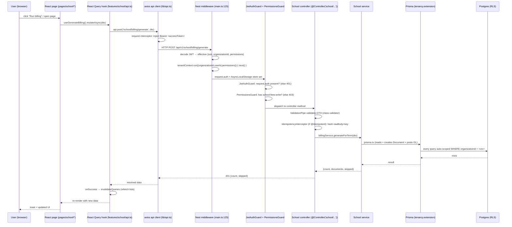

# School Management — Frontend → Backend Data & Workflow Flow (Detailed)

> Verified against source on branch `school/h1-backend-hardening`.
> Covers the **full vertical slice**: React (Vite) UI → axios client → auth/JWT →
> NestJS middleware/guard/pipe → controller → service → Prisma (tenancy RLS) →
> Postgres, and the response path back. Built on top of `school-vertical-flow.md`.

---

## PART A — The request lifecycle (every call, end to end)



### A.1 Frontend transport layer (`apps/web/src/lib/api.ts`)
- **Client**: `axios.create({ baseURL: VITE_API_URL + '/api/v1', timeout: 30000, Content-Type: application/json })`.
- **Request interceptor** injects `Authorization: Bearer <accessToken>` from `useAuthStore.getState().accessToken`. If a POS PIN session is active it also adds `X-Pos-User` (school flows don't use this, but it's harmless).
- **Response interceptor**: on `401` does **single-flight refresh** (`POST /auth/refresh` with the refresh token) then replays the original request once; on `403` shows "Permission denied"; on ≥500/network shows a generic error. This is why a stale session silently recovers without the user re-logging-in.
- **Asset URLs**: `resolveAssetUrl()` prefixes the API origin to relative file paths (report-card PDFs, student photos) so they load from the API origin, not the Vite dev origin.

### A.2 Auth state (`apps/web/src/stores/auth.store.ts`)
- Zustand store, **persisted to localStorage** under key `cafe-pos-auth` (note: shared with the POS — same auth domain).
- Holds `accessToken`, `refreshToken`, `user` (id/email/roles), `organization` (id/code/name/currencyCode/timezone), `permissions: string[]`, `currentBranchId`.
- `hasPermission()` is a simple `permissions.includes(...)`. The permissions array is returned by the login endpoint and is the source of truth for both UI gating (hide buttons) and backend `@RequirePermissions` checks.
- The JWT itself is the bearer; `organizationId` is **embedded in the JWT payload** and re-derived server-side (see B.1) — the store's `organization` is used only for display/currency.

### A.3 Tenant context (server-side, `main.ts:125-190`)
This is the linchpin of multi-tenancy. A custom middleware runs **before** the guards:
1. Reads `Authorization` header, verifies the JWT with `JwtTokenService`.
2. Computes `effective` identity: the JWT's `sub`/`organizationId`/`permissions`, narrowed by an `X-Pos-User` token if present (not used by school web).
3. Calls `tenant.run({ organizationId, userId: effective.sub, permissions })` which wraps the rest of the request in an **`AsyncLocalStorage`** store (`TenantContextService`). Every service reads `this.tenant.organizationId` from this store — it is never passed as a function argument.
4. Sets `req.auth = effective` so `JwtAuthGuard` can check presence.
5. Invalid/expired token → continues **unauthenticated**; the guard then throws `401`. (On-prem: device-token auth for `/sync/*` is also handled here but irrelevant to school web.)

### A.4 Guards & global pipes
- `JwtAuthGuard` (global): passes if `req.auth` is set, unless `@Public()`; else `401`.
- `PermissionsGuard` (global): reads `@RequirePermissions(...)` metadata; checks `tenant.permissions` (from the ALS store). Missing → `403` (frontend shows "Permission denied").
- `ValidationPipe` (global): validates/transforms the DTO with `class-validator`; bad input → `400` with field errors.
- `GlobalExceptionFilter`: maps thrown `HttpException`s and Prisma errors (e.g. `P2002` unique violation, `P2025` not found) to JSON error responses.
- `IdempotencyInterceptor` (per-route via `@Idempotent()`): hashes `req.rawBody` + `Idempotency-Key` header; replays the cached response on retry (used on `billing/generate` + `payments/collect` so mobile-money retries don't double-bill/double-collect).

---
## PART B — Concrete frontend → backend call contracts

All school routes are under base `/api/v1` + `/school`. Every list endpoint returns
`Paginated<T> = { data: T[], meta: { page, pageSize, total, totalPages } }`.

### B.1 Dashboard & foundation
| UI (page/tab) | Hook | HTTP | Backend handler | Writes / reads |
|---|---|---|---|---|
| Dashboard | `useSchoolOverview()` | `GET /school/overview` | `SchoolController.overview` → `SchoolService.adminOverview` | read counts + outstanding |
| Dropdowns | `useAcademicYears/useTerms/useClasses/useSections/useSubjects/usePeriods` | `GET /school/academic-years` etc (pageSize 100-300) | foundation controllers (BaseCrudService list) | read |
| Profile | `useSchoolOverview`'s sibling `GET /school/profile` (`SchoolController`) | read/create `SchoolProfile` | read |

### B.2 Students & guardians
| UI | Hook | HTTP | Handler | Effect |
|---|---|---|---|---|
| Student list | `useStudents({search,page})` | `GET /school/students?search=&page=` | `StudentController` (BaseCrudService + defaultInclude partner/class/guardians) | read |
| Create student | `useCreateStudent()` | `POST /school/students` | `StudentService.create` | **Partner + StudentProfile** atomic (see §3.1 of prior doc). Bypasses admissions. |
| Edit / status | `useUpdateStudent()` | `PATCH /school/students/:id` | `StudentService.update` | partner fields + status FSM (writes `StudentStatusHistory`) |
| Statement | `useStudentStatement(id)` | `GET /school/students/:id/statement` | `StudentService.statement` | read `Document`s (`school_fee/penalty/library_fine`) + `Payment`s |
| Guardians | `useGuardians(id)` / `useCreateGuardian()` | `GET /school/guardians/by-student/:id` / `POST /school/guardians` | `GuardianController` | `StudentGuardian` + `Contact` |
| Class roster | `useClassRoster(classId)` | `GET /school/students/by-class/:classId` | `StudentService.listByClass` | read active students |

**DTO crossing the wire (create student):**
```jsonc
// POST /school/students   (frontend CreateStudentInput → backend CreateStudentDto)
{
  "name": "Jane Doe", "admissionNo": "S-1001", "enrollmentDate": "2026-01-12",
  "email": null, "phone": null, "gender": "female",
  "currentClassId": "<uuid>", "currentSectionId": null,
  "residenceType": "day", "house": "Blue", "nationality": "UG", "religion": "Christian"
}
```
Backend responds with the `Student` shape (includes `partner.name`, `currentClass.name`).

### B.3 Admissions → enrollment (funnel)
The school **web currently has no admissions page** in `pages/school/*` (only
`students/attendance/timetable/exams/fees/promotion/dashboard`). The admissions
endpoints exist in the API (`school/admissions`) and the API client in
`features/school/api.ts` does **not** yet expose them — so admissions is
**API-complete but UI-incomplete** on this branch. The contract (verified in the
service) is:
- `POST /school/admissions` → `AdmissionsService.create` (status `submitted`)
- `POST /school/admissions/:id/:action` (review/accept/reject/schedule_exam/withdraw) → `AdmissionsService.review`
- `POST /school/admissions/:id/enroll` → `AdmissionsService.enroll` → mints Partner+StudentProfile+Enrollment.

### B.4 Fees — the full money round-trip (most important to understand)
Frontend `fees.tsx` has four tabs. Each maps to a hook → HTTP → service:

**(a) Collect payment tab** (`CollectTab`)
```
UI: select student → useStudentStatement shows balance
    amount + method(cash/bank/mobile_money/card) + optional reference
Hook: useCollectPayment().mutateAsync({ studentProfileId, amount, paymentMethod, reference? })
HTTP: POST /school/payments/collect
Backend: SchoolPaymentService.collect → PaymentService.createReceipt
Writes: Payment (posted) + PaymentAllocation(s) + Document.amountPaid/residual/status
        + CashMovement (if cash on open session) + GL journal
onSuccess: invalidate ['school','statement',id] + ['school','reports']
```
Note the UI explicitly handles `res.replayed` ("Payment already recorded") — that's
the idempotency replay from the `IdempotencyInterceptor` + the `reference` dedup
in the service.

**(b) Billing run tab** (`BillingTab`)
```
UI: select Term + optional Class → "Run billing"
Hook: useGenerateBilling().mutateAsync({ termId, classId? })
HTTP: POST /school/billing/generate   (@Idempotent)
Backend: BillingService.generateForTerm
Writes: per active student → Document(sales_invoice, sourceType='school_fee')
        + DocumentLine(s) + GL JournalEntry (Dr AR / Cr income) + status='posted'
onSuccess: invalidate ['school','statement'] + ['school','reports']
```
UI shows `result.count` created and `result.skipped` (already-billed) — that's the
3-level idempotency surfacing to the user.

**(c) Structures tab** (`StructuresTab`)
```
useCreateFeeStructure → POST /school/fee-structures   { name, academicYearId, components:[{code,productId,amount}], applicableTo?:{classIds} }
useCreateFeeSchedule → POST /school/fee-schedules     { feeStructureId, termId, dueDate }
useServiceProducts   → GET /products?productType=service&pageSize=200  (for the component dropdown)
```
These seed the data `generateForTerm` reads. **Required before billing**: if no
`FeeSchedule` exists for the term, the run throws "No fee schedule configured".

**(d) Arrears tab** (`ArrearsTab`)
```
useArrearsByClass  → GET /school/reports/outstanding-by-class  (live aggregate of open fee Documents)
useDailyCollections→ GET /school/reports/daily-collections?days=30
```

### B.5 Attendance
```
Roster:   useClassRoster(classId)        → GET /school/students/by-class/:classId
Register: useAttendanceRegister(c,d)     → GET /school/attendance/register?classId=&date=
Mark:     useMarkAttendance().mutate({ date, classId, sectionId?, entries:[{studentProfileId,status,minutesLate?,reason?}] })
                                        → POST /school/attendance/mark
Backend:  StudentAttendanceService.mark  (find-then-create/update in one tx; honors attendanceMode daily/period)
onSuccess: invalidate ['school','register',classId,date]
```

### B.6 Timetable
```
useClassTimetable(classId) → GET /school/timetable/class/:classId
usePeriods()               → GET /school/periods
useCreateSlot()            → POST /school/timetable/slots  (conflict-checked server-side)
```

### B.7 Examinations & report cards
```
useExamTypes / useExams / useExamSchedules   → GET /school/exam-types | /exams | /exam-schedules
useCreateExam + useExamAction('publish'|'close') → POST /school/exams  /  POST /school/exams/:id/publish|close
useGradesByClass(examScheduleId)             → GET /school/grades/by-class/:examScheduleId
useBulkGrades().mutate({ examScheduleId, entries:[{studentProfileId,marksObtained,maxMarks?,remarks?}] })
                                         → POST /school/grades/bulk-upsert   (computes grade+gpa live)
useGradeAction('submit'|'approve')        → POST /school/grades/submit/:examScheduleId | /approve/:examScheduleId
useReportCards(studentId)                  → GET /school/report-cards/by-student/:studentId
useGenerateReportCard().mutate({ studentProfileId, termId })
                                         → POST /school/report-cards/generate  (JSON payload; pdfUrl later)
```

### B.8 Promotion (in-progress on this branch)
```
useRollover().mutate({ fromTermId, toTermId, dryRun })  → POST /school/promotion/rollover
usePromoteStudent().mutate({ studentProfileId, toTermId, toClassId?, outcome?, reason? })
                                                        → POST /school/promotion/promote
Backend: PromotionService (marks current enrollment 'completed', creates new enrollment;
         graduation → status 'alumni'). onSuccess invalidates ['school','students']+['overview'].
```

---
## PART C — Caching, tenancy-RLS, errors, troubleshooting

### C.1 React Query caching & invalidation (why the UI updates)
Every school hook is a `@tanstack/react-query` `useQuery` (reads) or `useMutation`
(writes). The mutation `onSuccess` callbacks call `qc.invalidateQueries(...)` which
marks the matching cached query **stale and refetches on next render**:

| Mutation | Invalidates | What the user sees refresh |
|---|---|---|
| `useCreateStudent` / `useUpdateStudent` | `['school','students']`, `['school','student',id]` | roster, student list |
| `useCreateGuardian` | `['school','guardians',studentId]` | guardian list |
| `useGenerateBilling` | `['school','statement']`, `['school','reports']` | balances, arrears, collections |
| `useCollectPayment` | `['school','statement',studentId]`, `['school','reports']` | balance + arrears |
| `useMarkAttendance` | `['school','register',classId,date]` | that day's register |
| `useCreateSlot` | `['school','timetable',classId]` | timetable grid |
| `useBulkGrades` / `useGradeAction` | `['school','grades',examScheduleId]` | grade table |
| `useRollover` (committed) / `usePromoteStudent` | `['school','students']`, `['school','overview']` | roster + counts |

**Key implication:** reads are **never** sent with the mutation — the backend is the
source of truth and the UI refetches. So after "Run billing" the new posted invoice
appears because `['school','statement']` is invalidated and `useStudentStatement`
refetches. There is **no optimistic update** for school mutations (safer for financial
data, at the cost of a round-trip flash).

### C.2 Tenancy & RLS at the data layer (why cross-org data can't leak)
- The `TenantContextService` (AsyncLocalStorage) holds `organizationId` for the request.
- The **Prisma client extension** (`kernel/prisma/tenancy.extension.ts`) intercepts
  every query: on `create` it injects `organizationId`; on `find*/update/delete` it
  appends `WHERE organizationId = <ctx.organizationId>`. So even a hand-written query
  in a service is auto-scoped — a service cannot accidentally read another org's rows.
- Postgres **RLS policies** are the backstop (ADR-004): even if a query forgot the
  filter, the row policy rejects other-orgs rows. All school models are in `ORG_SCOPED`.
- `SchoolProfile.currencyCode` (default `UGX`) is what the UI uses for money formatting
  (`money()` in `fees.tsx` = `UGX ${n.toLocaleString()}`). It is **not** read from the
  JWT — it's fetched per-org. (If you deploy a non-UG school, this is the field to flip.)

### C.3 Error handling path
1. Service throws `BadRequestException` (FSM illegal jump, missing schedule, insufficient
   meal balance) / `NotFoundException` (missing row) / `Prisma.PrismaClientKnownRequestError`
   (`P2002` unique, `P2025` not found).
2. `GlobalExceptionFilter` converts to JSON `{ statusCode, message, error }`.
3. axios response interceptor: `401`→refresh+replay; `403`→"Permission denied";
   `>=500`→"Server error"; no status→"Network error". `notify.error(...)` toast shown.
4. The **UI wraps every mutation in try/catch** and shows a friendly `notify.error`
   (e.g. fees.tsx: "Billing run failed — check a fee schedule exists for the term").
   The raw backend message is **not** surfaced to the user (by design — avoids leaking
   internals), so when debugging, open the **browser Network tab** or the API **pino log**
   (`api.log`) to see the real error.

### C.4 Troubleshooting matrix (frontend symptom → cause → where)
| Symptom (UI) | Likely cause | Where to look |
|---|---|---|
| Redirected to login repeatedly | accessToken missing/expired AND refresh failed | `auth.store.ts` cleared; check `/auth/refresh` |
| "Permission denied" toast | user lacks `school:*` permission | `RequirePermissions` on controller; `permissions[]` in login response |
| Create student button missing | UI hides it via `hasPermission` | check `permissions` in store |
| Billing run: "No fee schedule configured" | no `FeeSchedule` for that term | `useCreateFeeSchedule` first; `FeeSchedule` rows |
| Balance doesn't drop after payment | `SchoolPaymentService.collect` allocations wrong, or `reference` replayed | `PaymentAllocation` + `Document.amountResidual`; `replayed:true` means dup |
| Statement shows 0 but fees expected | student `status != 'active'` (excluded from billing) or class not in `FeeStructure.applicableTo` | `StudentProfile.status`; `FeeStructure.applicableTo.classIds` |
| Arrears tab empty though fees exist | open-fee filter requires `paymentStatus in ['not_paid','partial']` AND `amountResidual>0` | `reporting.service.ts` `OPEN_FEE_WHERE` |
| Transport/hostel fee missing from AR | **Expected** — G2: those never bill (see prior doc). Only tuition + library fines hit the books. | `library-transport-hostel-cafeteria.service.ts` |
| Attendance date shows wrong mode | `SchoolProfile.attendanceMode` (daily vs period) drives `periodId` null vs set | `StudentAttendance.periodId` |
| Grade letter looks wrong | `GradingScale` default band vs built-in UCE/CBC (G7) | `grading.service.ts` `bandsFor` |
| Admissions page 404 | **Expected** — admissions is API-only, no `pages/school/admissions` yet | add page + api.ts hooks to wire UI |
| Report card PDF blank | `ReportCard.pdfUrl` is set by web-side PDF renderer, not the API generate (API only builds JSON `payload`) | web `report-card-pdf.service.ts` |

### C.5 End-to-end trace: "Record a 50,000 UGX cash fee payment" (worked example)
1. `fees.tsx CollectTab`: user picks student `S-1001`, types `50000`, method `cash`.
2. `useCollectPayment().mutateAsync({studentProfileId, amount:50000, paymentMethod:'cash'})`.
3. axios `POST /api/v1/school/payments/collect`, header `Authorization: Bearer <jwt>`.
4. main.ts middleware decodes JWT → `tenant.run({organizationId:'ORG-X', userId:'U-1', permissions:[...]})`.
5. `JwtAuthGuard` passes (auth set); `PermissionsGuard` checks `school:fees:write` (controller decorator).
6. `ValidationPipe` validates the DTO.
7. `IdempotencyInterceptor` (if `Idempotency-Key` sent; mobile-money path may omit).
8. `billing.controller` → `SchoolPaymentService.collect`:
   - reads `StudentProfile` → gets `partnerId`.
   - finds open `Document`s (`school_fee/penalty/library_fine`, `not_paid`/`partial`, residual>0), oldest first.
   - allocates 50,000 across them (Decimal math).
   - calls `PaymentService.createReceipt` → writes `Payment` (posted) + `PaymentAllocation`s + GL journal (Dr Cash / Cr AR) + `CashMovement` (cash on open session) + updates each `Document.amountPaid/residual/status` + audit row + events.
9. Returns `{payment, allocations, unallocated, replayed:false}`.
10. axios resolves → `onSuccess` invalidates `['school','statement',id]` + `['school','reports']`.
11. `useStudentStatement` refetches → balance drops by 50,000; Arrears tab recomputes.
12. Toast: "Collected UGX 50,000 · N invoice(s) settled".

---
## Summary of the architecture (one paragraph)
The school web is a thin React (Vite + TanStack Query) SPA that talks JSON to a NestJS
API over `/api/v1`. Auth is a JWT bearer injected by an axios interceptor; the server
decodes it in a `main.ts` middleware that establishes an `AsyncLocalStorage`
tenant context (org + user + permissions) for the whole request. Global guards enforce
auth + per-route permissions; a global `ValidationPipe` validates DTOs; an idempotency
interceptor protects the two money endpoints. Controllers are thin and delegate to
services that read `organizationId` from the tenant context (never from the URL), and a
Prisma extension + Postgres RLS guarantee every query is org-scoped. All school money
reuses the platform's `Document`/`Payment`/`PostingService` so tuition + library fines
post to the same GL as POS sales. Reads are cached by React Query and explicitly
invalidated after each mutation, so the UI always reflects the server after a write.


