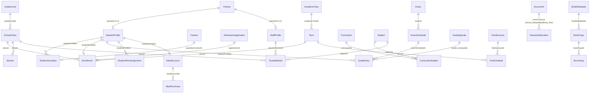
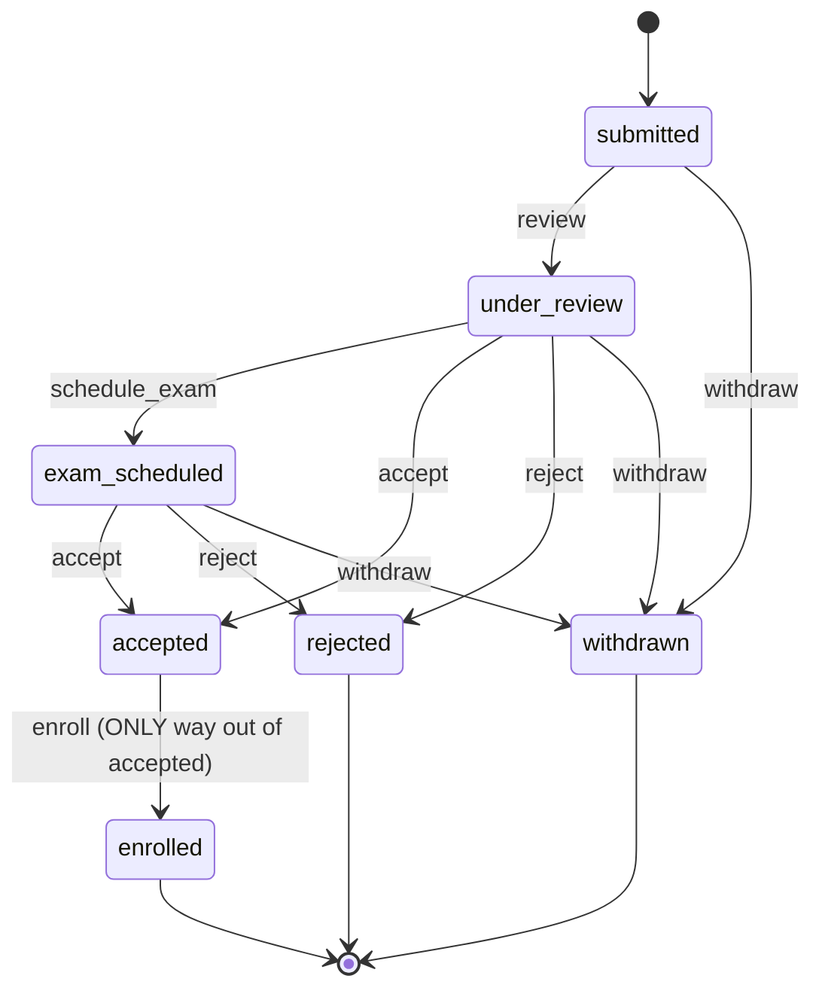
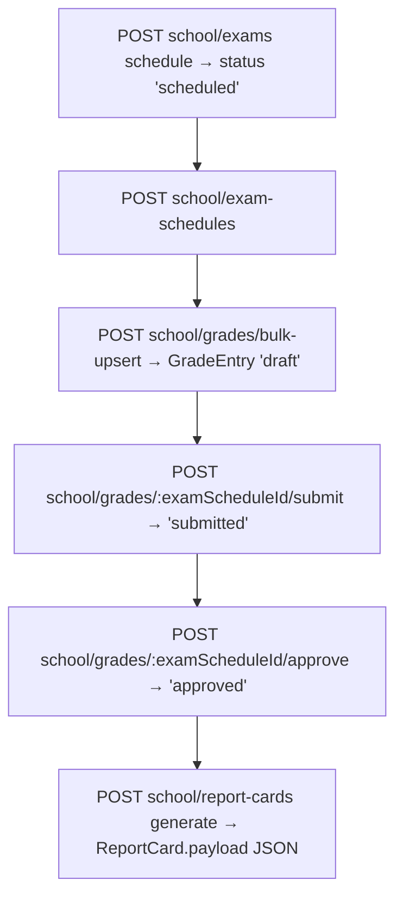
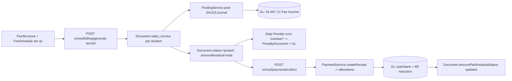

# School Vertical — Architecture, Data Flow & Workflow

> Verified against source on branch `school/h1-backend-hardening` (commit `1947db2` area).
> Every claim below was read from `apps/api/src/modules/school/**` and the kernel
> (`apps/api/src/kernel/**`) directly — not from the README alone. Divergences from
> the README are flagged as **GAP** / **QUIRK**.

## 1. Big-picture architecture

The school vertical is a **port of a finished school module onto an existing
POS-CAFE-style ERP core** (ADR-011 "vertical extension contract"). It does NOT
reinvent accounting, partners, inventory, or workflow — it reuses them.

```
            ┌─────────────────────────────────────────────┐
            │  SchoolModule  (vertical manifest)           │
            │  registers workflows + imports sub-modules   │
            └──────────────┬──────────────────────────────┘
       ┌──────────┬────────┼────────────┬──────────┬──────────┐
  Foundation  People   Admissions  Academics  Attendance  LMS  Examinations
       └──────────┴────────┼────────────┴──────────┴──────────┘
                           │  (imports DOWNWARD only)
            ┌──────────────┼──────────────────────────────────┐
            │  Core (Partner, Product) · Invoicing (Document,  │
            │  Payment) · Accounting (Posting, Accounts) ·     │
            │  Inventory · Kernel (workflow, tenancy, events,  │
            │  audit)                                          │
            └──────────────────────────────────────────────────┘
```

**Two cross-cutting spines everything hangs off of:**

1. **State spine** — `kernel/workflow/workflow.service.ts` (`WorkflowService`).
   The engine resolves a `WorkflowDefinition` from `WorkflowRegistry`, loads the
   row, checks permission, runs guard + side-effect, updates `status`, writes
   `AuditLog`, and emits a domain event — all in ONE Prisma transaction.
2. **Money spine** — `invoicing/DocumentBuilderService` + `accounting/PostingService`.
   Every school fee/fine/penalty is a `Document(type='sales_invoice')` that is
   posted to the GL. **Zero new accounting code** (the project's stated proof of
   reuse).

### Tenancy & RLS
- Every school table has `organizationId NOT NULL` and is listed in `ORG_SCOPED`
  in `kernel/prisma/tenancy.extension.ts` (verified: `Campus`, `SchoolClass`,
  `StudentProfile`, … are present). The Prisma client extension auto-injects
  `organizationId` on writes and filters it on every read. RLS is a second safety net.

### Route map (prefix `school/…`)
| Sub-domain | Controller prefix | Module file |
|---|---|---|
| Foundation | `school/campuses`, `school/classes`, `school/sections`, `school/departments`, `school/grade-levels`, `school/subjects`, `school/academic-years`, `school/terms`, `school/periods`, `school/calendar` | `foundation/*` |
| People | `school/students`, `school/staff`, `school/positions`, `school/guardians`, `school/staff-attendance`, `school/students/:id/medical-record`, `school/students/:id/documents`, `school/promotion` | `people/*` |
| Admissions | `school/admissions` | `admissions/*` |
| Academics | `school/curricula`, `school/lesson-plans`, `school/teacher-assignments`, `school/timetable` | `academics/*` |
| Attendance | `school/attendance` | `attendance/*` |
| LMS | `school/homework`, `school/submissions`, `school/learning-resources`, `school/announcements` | `lms/*` |
| Examinations | `school/exam-types`, `school/exams`, `school/exam-schedules`, `school/grades`, `school/grading-scales`, `school/report-cards` | `examinations/*` |
| Fees | `school/fee-structures`, `school/fee-schedules`, `school/student-fee-assignments`, `school/discounts`, `school/scholarships`, `school/installment-plans`, `school/penalty-rules`, `school/penalty-runs`, `school/billing`, `school/payments` | `fees/*` |
| Library/Transport/Hostel/Cafeteria | `school/library/*`, `school/transport/*`, `school/hostel/*`, `school/cafeteria/*` | `library/*` + per-topic modules |
| Portals | `school/portals/parent`, `school/portals/student`, `school/portals/teacher` | `portals/*` |
| Reporting | `school/reports/*`, `school/overview`, `school/profile` | `reporting/*` + root controller |

---
## 2. Data model (ERD — the skeleton)

The school schema is ~570 lines of Prisma models (`Campus` → `SchoolDashboardCache`).
The crucial design decision: **a Student and a Staff member are NOT separate person
tables** — both are a `Partner` (the ERP's universal party, `isCustomer=true` /
`isCompany=false`) + a profile table that carries school-specific metadata. This is
ADR-008/ADR-011: reuse the partner/AR machinery so a student's fees flow through the
exact same invoice + ledger + collections pipeline as a POS customer.



**Key entities & their role**

| Group | Models | Purpose |
|---|---|---|
| Org/Foundation | `Campus`, `SchoolProfile`, `AcademicYear`, `Term`, `Department`, `GradeLevel`, `SchoolClass`, `Section`, `Subject`, `Period`, `SchoolCalendarEvent` | The static "where/when/what" scaffold. `SchoolProfile` carries country (`UG`), `currencyCode` (`UGX`), `educationLevel`, `gradingSystem` (UCE/UACE/CBC), `attendanceMode` (`daily`/`period`). |
| People | `StudentProfile` (+`StudentStatusHistory`, `StudentGuardian`, `MedicalRecord`, `StudentDocument`), `StaffProfile` (+`StaffStatusHistory`, `Position`, `StaffAttendance`) | Person master. `StudentProfile.admissionNo` is the business key; `status` is the lifecycle enum. |
| Admissions | `AdmissionApplication` (+`ApplicationDocument`, `EntranceExam`, `WaitingList`), `Enrollment` | Funnel from applicant → enrolled student. `Enrollment` is the immutable "was in class X for term Y" fact. |
| Academics | `Curriculum`/`CurriculumSubject`, `LessonPlan`, `TeacherAssignment`, `TimetableSlot` | Teaching plan + schedule. `TimetableSlot` has conflict detection (teacher/room/class double-booking). |
| Attendance | `StudentAttendance` | One row per (student, date, periodId?). `periodId` NULL = daily; set = period attendance (secondary schools). |
| LMS | `HomeworkAssignment`/`HomeworkSubmission`, `LearningResource`, `Announcement` | Coursework + comms. |
| Examinations | `ExamType`, `Exam`, `ExamSchedule`, `GradeEntry`, `GradingScale`, `ReportCard`, `AcademicTranscript` | Marks → grades → report cards. |
| Fees | `FeeStructure`/`FeeSchedule`, `StudentFeeAssignment`, `Discount`, `Scholarship`, `InstallmentPlan`, `PenaltyRule`/`PenaltyRun`/`PenaltyAssessment` | Billing config + penalty engine. |
| Ancillary | `BookMetadata`/`BookCopy`/`Borrowing`, `Vehicle`/`Route`/`Stop`/`StudentTransportAssignment`, `Dormitory`/`Room`/`Bed`/`HostelAllocation`, `MealPlan`/`MealAccount`/`MealPurchase` | Library, transport, hostel, cafeteria. |
| Reporting | `SchoolDashboardCache` | Snapshot cache keyed by `kind` (admin/academic/finance/operational) + `asOf`. |

**The three enums that ARE the state machines:**
- `AdmissionStatus`: `submitted | under_review | exam_scheduled | accepted | rejected | enrolled | withdrawn`
- `StudentStatus`: `active | suspended | transferred | withdrawn | alumni`
- `StaffStatus`: `active | on_leave | suspended | terminated | retired`
- (plus `ExamStatus`, `GradeEntryStatus`, `AttendanceStatus` below)

---
## 3. Core workflow & data-flow traces

### 3.1 Admission → Enrollment → Student (the funnel)

**Endpoint surface** (`@Controller('school/admissions')` + `people/student.controller`):
- `POST school/admissions` → `AdmissionsService.create` (status `submitted`)
- `POST school/admissions/:id/:action` (action ∈ `review|accept|reject|schedule_exam|withdraw`) → `AdmissionsService.review`
- `POST school/admissions/:id/enroll` → `AdmissionsService.enroll`
- `POST school/students` → `StudentService.create` (direct create, bypasses admissions)
- `POST school/students/bulk-import` → `StudentService.bulkImport`

**State machine (AdmissionStatus)** — hand-rolled FSM in `ADMISSION_TRANSITIONS`:



**The `enroll` side-effect is the keystone** — it mints the real records atomically:
1. `Partner.create` (`isCustomer=true`, code `STU-…`, name/DOB/gender in `customFields`)
2. `StudentProfile.create` (`partnerId`, `admissionNo = applicationNumber`, class/section)
3. `Enrollment.create` (links `applicationId` → `studentProfileId`, `classId`, `termId`, `rollNumber`)
4. `AdmissionApplication.status → 'enrolled'`
5. Audit + events (`SchoolAdmissionEnrolled`, `SchoolStudentCreated`)
→ After this the student is on the class roster and appears in billing.

**DB WRITE MAP (enroll):**
| Table | Row(s) written |
|---|---|
| `Partner` | +1 (student as customer) |
| `StudentProfile` | +1 (`status=active`) |
| `Enrollment` | +1 (`status='enrolled'`) |
| `AdmissionApplication` | status `accepted`→`enrolled` |
| `AuditLog` | +1 |

> **QUIRK (code ≠ README):** `AdmissionsService` does NOT use `WorkflowService.transition()`.
> It hand-rolls `ADMISSION_TRANSITIONS` + direct `updateMany`. `school.module.ts` ALSO
> registers an `admission_application` `WorkflowDefinition`, but **nothing calls it** —
> it is dead config. Same for lesson_plan / exam / grade_entry / attendance_correction
> (see §5). Enforcement is real (illegal jumps throw), just not via the kernel engine.

> **QUIRK:** `create()` declares a duplicate-application guard but never uses the
> normalized name variables (`void normalizedFirst; void normalizedLast`) — it matches
> case-insensitively via Prisma `mode:'insensitive'` instead. Harmless but dead code.

### 3.2 Student lifecycle (StudentStatus FSM)

`StudentService.update` enforces `STUDENT_STATUS_TRANSITIONS`:
`active → {suspended, transferred, withdrawn, alumni}`; `suspended → active`;
`withdrawn → active`; `transferred` and `alumni` are **terminal** (no exit).
Every legal change writes `StudentStatusHistory` + emits `SchoolStudentStatusChanged`.
`remove()` is **soft delete** (sets `deletedAt` on both `StudentProfile` and `Partner`).

### 3.3 Academics: Curriculum → Timetable

- `POST school/curricula` → `CurriculumService.create` (nested `CurriculumSubject` rows)
- `POST school/lesson-plans` + `POST …/publish` → `LessonPlanService.publish` (status `draft`→`published`)
- `POST school/teacher-assignments`, `POST school/timetable` (conflict-checked) / `…/bulk-upsert` (wipes + reinserts a class's slots)
- **Timetable conflict detection** (`detectConflicts`): rejects teacher double-book, room double-book, class double-book for (day, period).

> **QUIRK:** `LessonPlanService.publish` comment states *"A real WorkflowService transition
> would be used in production"* — i.e. the registered `lesson_plan` workflow is not invoked.

### 3.4 Attendance (daily vs period)

`POST school/attendance/mark` (`StudentAttendanceService.mark`):
- `SchoolProfile.attendanceMode` decides the register. `daily` → one row per student/day
  (`periodId=NULL`). `period` → one row per student/day/period (subject-teacher schools).
- Idempotent find-then-create/update inside one tx. Partial unique indexes (migration-level,
  since NULL `periodId` can't be a Prisma compound-unique upsert) are the safety net.
- Emits `SchoolAttendanceMarked` with present/absent/late counts.
- No workflow; `attendance_correction` is registered but unused. `AttendanceStatus` =
  `present|absent|late|excused`.

### 3.5 Examinations → Grades → Report Card



- **Grading math** (`GradingService.bandFor(marks, maxMarks)`): `pct = marks/maxMarks*100`,
  then find the `GradingScale.bands[]` where `min ≤ pct ≤ max`. Built-in systems:
  UCE (`D1`..`F9`, gpa 4.0→0.0), CBC (`A`..`F`), generic. Returns `{grade, gpa}`.
  `GradeEntry.grade` / `gradePoint` are set on upsert — recomputed live, not stored-stale.
- **Exam FSM**: `draft → scheduled (schedule) → published (publish) → closed (close)`.
  `closed` is **terminal** (locked; no grades should change after). `grade_entry`:
  `draft → submitted (submit) → approved (approve)` / `rejected (reject) → submitted (resubmit)`.
- **Report card** (`ReportCardService.generate`): deterministic id `rc_<student>_<term>`,
  upserts payload = `{system, gpa, rank, meanPercent, totalMarks, sections, summary, eligible,…}`
  computed by `ReportCardTemplateService` + `GradingService.computeTermGpa`. PDF is rendered
  on the **web** side (`report-card-pdf.service.ts` builds the PDF; `ReportCard.pdfUrl` stored).

---
## 4. The money flow — Fees, Penalties, Payments, GL

This is the part that must reconcile. It is the one place the vertical truly reuses
the platform, and it is where the H1/H2 hardening fixes live.



### 4.1 Billing — `BillingService.generateForTerm(termId, classId?)`
For each **active** student in scope, resolves the `FeeSchedule` whose `FeeStructure`
applies to the student's class, then for each fee `component`:
- applies per-student `StudentFeeAssignment.customDiscount` (override per `code`),
- applies active `Scholarship` (percent/fixed) per line,
- builds one `Document(type='sales_invoice', sourceType='school_fee', sourceId=scheduleId, reference='TERM-<termId>')`.

**Idempotency (THREE levels — P0-6 fix for double-billing):**
1. App-level check: `findFirst` for the same `(org, partnerId, sourceType, sourceId, reference)`.
2. DB unique constraint `@@unique([organizationId, sourceType, sourceId, reference])`.
3. The read+create run inside **one `$transaction`** so a concurrent bursar can't insert a dup.

**GL post (every invoice immediately posted — no separate "post" step):**
- `documentBuilder.groupForPosting(doc, 'sales')` → `counterAccount` (AR) + `itemByAccount` (income).
- `posting.post({ journalCode:'SALES', lines:[Dr AR, Cr income] })` → `JournalEntry`.
- Document promoted to `status='posted'`, `paymentStatus='not_paid'`, `amountResidual=total`, `journalEntryId=entry.id`.
- Emits `SchoolFeeInvoiceDrafted` + `SchoolFeeInvoicePosted`.

### 4.2 Penalty engine — `generatePenaltyRun(scheduleId)` (daily cron)
- Idempotent per day: `@@unique([organizationId, scheduleId, cronDate])` → re-running same day returns existing run.
- Finds overdue `Document`s (`sourceType='school_fee'`, `status in ['posted','partial']`, `dueDate < cutoff` where `cutoff = dueDate + graceDays`).
- Per-source idempotency: `@@unique([sourceDocumentId, penaltyRunId])` → **kills the old "every cron tick mints a new penalty" silent-compounding bug**.
- Each penalty = a `Document(type='sales_invoice', sourceType='school_penalty')` with a `DocumentLine`, **posted to GL** (the P0-2/H6 fix — old code left it as an unposted `draft`, so late fees never hit the books), linked via `PenaltyAssessment` (→`PenaltyRule`, `sourceDocument`, `penaltyDocument`).

### 4.3 Payment collection — `SchoolPaymentService.collect(dto)` (P2A/B1 fix)
- Delegates to the platform's single writer `PaymentService.createReceipt` (NOT hand-rolled
  Payment + GL + allocations — that was a ledger-integrity hole: it mutated `Document` fields
  directly, did float math, and never wrote `CashMovement`, so school collections were missing
  from cash-session Z-reports and bank reconciliation).
- Allocates oldest-first to open invoices where
  `sourceType in ['school_fee','school_penalty','library_fine']` and `paymentStatus in ['not_paid','partial']`, `amountResidual > 0`.
- Idempotency: mobile-money replay guard — same `reference` returns original receipt.
- Emits `SchoolFeePaymentRecorded` per allocation.

### 4.4 Fee statement — `StudentService.statement(id)`
Aggregates `Document`s (`sourceType in ['school_fee','school_penalty','library_fine']`) to show
`totalBilled / totalPaid / balance`. **Note:** transport/hostel/meal are NOT in this list
(see §5) — they never become these Documents.

### 4.5 GL account resolution
Income/AR accounts come from `AccountDeterminationService` via `documentBuilder.groupForPosting`,
driven by `AccountMapping` + the `Product` (each fee component references a `Product(type='service')`).
Journal code is always `SALES`. So a school fee posts: **Dr Accounts-Receivable (control) / Cr Fee-Income (per product mapping)** — identical shape to a POS sale.

---
## 5. Ancillary services, Portals, Reporting & Known Gaps

### 5.1 Library — DOES bill the GL ✅
- `POST school/library/borrowings` (`BorrowingService.borrow`): `BookCopy.status → 'borrowed'`, `Borrowing` row created.
- `POST school/library/borrowings/:id/return` (`return`): if `now > dueAt`, fine = `daysOverdue × 200 UGX` (hard-coded default).
  - On a student overdue fine > 0: creates `Document(type='sales_invoice', sourceType='library_fine')` + `DocumentLine`, **posts to GL** (`posting.post`, journal `SALES`), links `Borrowing.fineInvoiceId`. So library fines ARE collectable through `SchoolPaymentService.collect` (it includes `library_fine` in the open-set filter).
  - `BookCopy.status → 'available'`.
- This is the **only** ancillary service that generates a posted invoice. Transport/hostel/meal do not (see GAP below).

### 5.2 Transport / Hostel / Cafeteria — track data, do NOT bill ⚠
Verified by grepping the combined `library-transport-hostel-cafeteria.service.ts`:
- **Transport** (`StudentTransportAssignment.assign`): writes only `StudentTransportAssignment` (carries `monthlyFee`). `Route.monthlyFee` + `Route.feeProductId` exist but **nothing generates a `Document`** from them. No GL post.
- **Hostel** (`HostelAllocationService.allocate/checkout`): flips `Bed.status` (`available`↔`occupied`), writes `HostelAllocation`. `Room.monthlyFee` + `Room.feeProductId` are **dangling** — never invoiced.
- **Cafeteria** (`MealAccountService.topUp/purchase`): `topUp` increments `MealAccount.balance` (and a `MealPurchase` row); `purchase` decrements balance. **No `Payment`, no `Document`, no GL post.** It's a private prepaid wallet, not school AR. The `paymentId` param on `purchase` is accepted but rarely set.
- `feeProductId` columns on `Room`, `Route`, `MealPlan` are **schema-only** — the billing generator was never written. So transport/hostel fees are invisible to AR, the finance dashboard, and statements.

### 5.3 Portals (read-only aggregations — no new state)
- `GET school/portals/parent/:studentProfileIds` → `parentDashboard`: children + attendance% + fee balance + announcements.
- `GET school/portals/student/:id` → `studentDashboard`: timetable + attendance + grades + assignments + announcements.
- `GET school/portals/teacher/:id` → `teacherDashboard`: classes + today's schedule + pending grade drafts.
All are pure `findMany`/`groupBy` reads composed from the tables above. Auth via `PERMISSIONS.school.parentPortal/studentPortal/teacherPortal`.

### 5.4 Reporting / Dashboards
- `GET school/overview` (`SchoolService.adminOverview`), `GET school/reports/{admin,academic,finance,operational}`, plus `outstanding-by-class`, `attendance-today`, `top-performers`, `daily-collections`.
- All aggregate live from `Document`/`Payment`/`GradeEntry`/`StudentAttendance`. **Important:** the open-fee filter is `paymentStatus in ['not_paid','partial']` AND `amountResidual > 0` (the P0/H fix — the old filter dropped `not_paid` and added `paid`, hiding the largest arrears).
- `SchoolDashboardCache` exists as a snapshot table but is **not populated by any endpoint in this vertical** — dashboards are computed live each call (cache is a planned optimization).

---

## 6. Consolidated KNOWN GAPS / QUIRKS (the troubleshooting shortlist)

| # | Severity | Finding | Where | Impact |
|---|---|---|---|---|
| G1 | **HIGH** | Workflow engine is dead. The 5 `WorkflowDefinition`s registered in `school.module.ts` (`admission_application`, `lesson_plan`, `exam`, `grade_entry`, `attendance_correction`) are **never invoked** — `admissions`/`academics`/`examinations` hand-roll their own FSMs; `attendance_correction` has no endpoint at all. | `school.module.ts` vs `*/service.ts` | State enforcement works, but the kernel engine (permission gating, guards, audit-via-engine, event-via-engine) is bypassed for these. Audit/events are re-done manually in each service. |
| G2 | **HIGH** | Transport, Hostel, Cafeteria fees never bill. `feeProductId`/`monthlyFee` fields are schema-only; no `Document`/GL post is generated. | `library-transport-hostel-cafeteria.service.ts` | These fees are invisible to AR, finance dashboards, and statements. Only tuition + library fines hit the books. |
| G3 | MED | `MealAccount` is a private wallet, not AR. `topUp`/`purchase` never create a `Payment` or post to GL. | `MealAccountService` | Cafeteria spend isn't reconcilable against cash/bank. |
| G4 | MED | `SchoolDashboardCache` is unused — every dashboard query is live (N+1 risk at scale). | `reporting.service.ts` | Performance, not correctness. |
| G5 | LOW | `AdmissionsService.create` declares a dedup guard but the normalized-name variables are `void`-ed (dead code); real dedup uses Prisma `mode:'insensitive'`. | `admissions.service.ts:73-134` | Harmless. |
| G6 | LOW | `LessonPlanService.publish` comment admits it should use `WorkflowService` "in production" — confirms G1 is known, not accidental. | `academics.service.ts:78` | Awareness gap. |
| G7 | INFO | Grading `bandFor` uses built-in UCE/CBC/generic bands when no `GradingScale` exists; a custom scale (or `SchoolProfile.gradingSystem`) only takes effect if a `GradingScale` row with `isDefault` exists. | `grading.service.ts` | If you set `gradingSystem:'UACE'` but no scale row, it silently falls back to the closest built-in. |
| G8 | INFO | Promotion (`school/promotion`, in-progress on this branch) enforces immutable history: it marks the current enrollment `completed` and CREATES a new one for the next term; graduation moves `status→alumni` (terminal). Rollover is dry-run by default and resumable (one tx/student). | `promotion.service.ts` | Good design — note it's untracked/new on this branch, not yet in a released module barrel. |

### "What status keeps the status" — terminal/locked states
- **AdmissionStatus**: `rejected`, `withdrawn`, `enrolled` → **terminal** (no transitions defined out).
- **StudentStatus**: `transferred`, `alumni` → **terminal** (cannot return). `suspended`/`withdrawn` can return to `active`.
- **ExamStatus**: `closed` → **terminal/locked** (no transition out; treat grades as frozen).
- **GradeEntryStatus**: `approved` is the lock state for a grade (can't be re-edited without `reject→resubmit`).
- **Enrollment.status**: `enrolled` is current; promotion flips it to `completed` (history). `transferred_out`/`withdrawn` exist as string values but the promotion service drives `completed`.

### Quick troubleshooting map
| Symptom | Look at |
|---|---|
| Double-billed a student | `generateForTerm` idempotency (app check + unique + tx) — check `Document` rows for duplicate `reference='TERM-<termId>'`. |
| Late fees not on the books | Confirm `PenaltyRun` exists for the day + `PenaltyAssessment`/`PenaltyDocument` posted (`sourceType='school_penalty'`). |
| Payment not reducing balance | `SchoolPaymentService.collect` allocations → `PaymentService.createReceipt`; check `PaymentAllocation` + `Document.amountResidual`. |
| Transport/hostel fee missing from AR | **Expected** — G2: these never bill. |
| Student not in billing | Must be `status='active'` + in a class covered by a `FeeSchedule`'s `FeeStructure.applicableTo`. |
| Grade shows wrong letter | `GradingScale` default band vs `grading.service.ts` built-ins (G7). |
| Daily vs period attendance mismatch | `SchoolProfile.attendanceMode` + `StudentAttendance.periodId` NULL-vs-set. |


