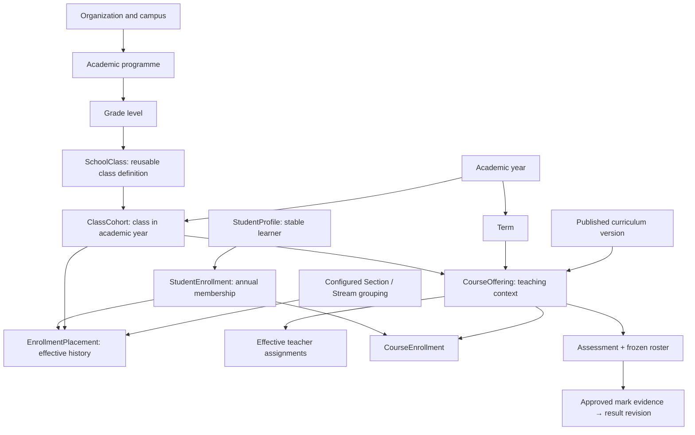

# School Management System — production review

Review date: **3 September 2026**. Reviewed checkout: **`6acb599`** (`feat(academics): land phases 6-8 — statutory submissions, hardening, pilot runbook`).

**Verdict: NO-GO as the authoritative system for school records, money and published results.** Retain the modular architecture and the recently implemented academic core. Complete the integration between old and new workflows, correct the identified financial and historical-report defects, and demonstrate recovery and tenant isolation before a controlled pilot.

Companion deliverable: [Phase-by-phase development, migration and pilot plan](C:/Users/Simon/OneDrive/Documents/GitHub/School-Management/docs/architecture/PRODUCTION_DELIVERY_PLAN_2026-09-03.md). It contains sections T–V: the delivery roadmap, pilot and final definition of done.

## A. Executive summary

This is an extensive ERP with a school vertical, not a small student CRUD application. It has a NestJS API, two React clients, PostgreSQL/Prisma, a shared permission/contract package, accounting and document engines, background processing and substantial domain tests. The most valuable assets are the common financial posting engine, transaction-aware audit/outbox services, and the newer enrollment, teaching and assessment models.

The principal problem is **incomplete consolidation**. New authoritative models coexist with older writers and readers. An admissions transaction can succeed without creating the annual enrollment that the new course roster expects. Billing selects today's class when billing a selected term. Report provenance can name one result revision while its content comes from another, and a historical PDF still reads current class and settings. Payroll has a specific multiple-loan allocation defect. The deployment configuration also does not implement the isolation its staging overlay appears to promise.

Prioritize three outcomes:

1. Every business fact has one owner and one controlled write path.
2. Every displayed financial or academic figure can be explained from immutable source records.
3. The actual release image, database role, migration and recovery procedure pass measurable gates.

Do not start a wholesale rewrite. Do not add a generic Person model, a second grading store or another application workflow merely to make the diagram cleaner. Do not make complete payroll, advanced LMS, manufacturing or rental functionality prerequisites for a first-school launch when they can be disabled.

### What changed since the supplied review

| Earlier assertion | Current evidence and decision |
|---|---|
| Working tree contains numerous uncommitted changes | The checkout was clean at the start of this review. This is no longer a finding. |
| Missing `Mail` / `CheckCircle2` imports block the web typecheck | Web and portal typechecking passed in this review. Do not repeat that defect. The API typecheck failed for a different reason: heap exhaustion. |
| Annual enrollment and programmes need to be built | `AcademicProgramme`, `ClassCohort`, `StudentEnrollment`, `EnrollmentPlacement` and related services already exist. **IMPROVE** their adoption and cross-module integration. |
| Section and Stream must always be merged | Current grouping modes explicitly support neither, one or both. **KEEP** this capability; simplify the default school configuration and establish clear terminology. |
| Teacher belongs in CourseOffering identity | Teachers are effective-dated assignments. Replacing a teacher must not create a different course or detach its marks. |
| Homework scores do not reach results | The legacy grading bridge now writes through `MarkingService.postMark`; several legacy HTTP mutations return 410. **IMPROVE** reconciliation and complete the unified workflow, rather than inventing another score store. |
| MFA is broken | Current code imports the otplib v13 API and has encrypted-secret handling. The old claim is not established by this review. Full enrollment/login/recovery and privileged enforcement remain unproven. |
| CI runs very little academic integration | CI now includes dedicated academic phases. Fees concurrency/integrity, admissions concurrency, payroll and the broader reporting integration suite are still outside the explicit integration selection. |
| Prior fees audit establishes readiness | It records earlier results against particular demo/test data. It is useful history, not proof for this commit or the school being launched. |

### Method and limits

Reviewed both supplied documents, repository structure, current source paths, schema portions and migrations, CI/Compose/Docker configuration, role presets, representative portal/admin UI, tests, existing financial audits and operational runbooks. Traced admissions → enrollment → course roster; homework → marks; result revision → report → PDF; billing → shared payment/posting → balance queries; mobile-money callback handling; payroll calculation → loan updates and GL.

The findings distinguish **executed evidence**, **source-confirmed defects**, and **unproven release gates**. This was not an authenticated browser UAT, penetration test, exhaustive review of every ERP module, live ledger certification or successful migration rehearsal. No application code or database migration was changed. Only the two review documents were added.

### Verification performed

| Check | Result | Meaning |
|---|---|---|
| Git status and current commit | Clean initial tree; `6acb599` | Stable review reference. |
| `pnpm typecheck` | Shared, web and portal passed; API aborted with V8 heap exhaustion around 4 GB | The default verification command is not green. This does **not** establish a TypeScript source error or an application runtime memory leak. |
| Targeted Jest run: nine suites | **8 passed, 1 failed; 129 tests passed, 7 failed** | All seven failures were `report-definition-canon.spec.ts`, one per report definition file. |
| Academic/role suites in that run | FSM, grouping, course context, Phase 4/5 contracts, golden result computation, role presets and route-permission coverage passed | Useful contract evidence; not a replacement for HTTP/database/concurrency tests. |
| `pnpm lint:arch` | Passed: 1,032 modules and 2,992 dependencies, no violations | Module dependency boundaries pass their current rules. |
| Broader unit/module selection | Attempted, then stopped | Some tests outside `test/integration` access a configured database; authentication failed. No whole-suite pass is claimed. The targeted rerun used an intentionally unreachable database URL. |
| Compose base + staging rendering | Completed with audit-only placeholder variables | Original public port mappings remain in the merged configuration. See P0-01. |
| Docker engine | Unavailable | Images, container startup and isolated PostgreSQL integration were not verified. |
| Live financial gates, migration/restore/load tests | Not completed | Required evidence before launch, not assumed passes. |

Targeted machine-readable test evidence: [Jest results](C:/Users/Simon/.codex/attachments/school-readiness-targeted-20260903.json). These checks do not certify the complete application or the live database.

## B. Current architecture assessment

**KEEP — modular monolith; no redesign required for the deployment shape.** A single API and PostgreSQL are appropriate for the stated first school of 1,000 learners, 100 teachers and approximately 20 administrators, subject to load tests. Microservices would introduce distributed failure modes without fixing the present correctness problems.

| Layer | What exists | Assessment |
|---|---|---|
| Admin client | React/Vite, school workspaces alongside the wider ERP | **IMPROVE** role-specific navigation and terminology. |
| Portal | Separate student, guardian and teacher application | **KEEP** the separate client. **IMPROVE** workflow depth, session storage and error recovery. |
| Kernel | Authentication, tenancy, permissions, audit, sequences, encryption, idempotency, events, files | **KEEP** shared services; close enforcement and lifecycle gaps. |
| Shared business engines | Documents, invoicing, payments, GL, inventory, procurement, HR | **KEEP** canonical payment/posting reuse; reduce cross-domain knowledge and unchecked `any`. |
| School domain | Admissions, annual enrollment, curriculum, teaching, attendance, assessment, exams, fees, reporting and ancillary modules | **IMPROVE** interfaces and retire incompatible legacy writers. |
| Database | Large Prisma schema; RLS migrations; domain constraints; compatibility tables and archived migration trees | **IMPROVE** migration proof, composite ownership and schema ownership. |
| Operations | Docker, Caddy, health/metrics components, staging and pilot/restore documents | **IMPROVE** executable configuration and evidence. A runbook is not an executed drill. |

The accounting engine should remain the only owner of posted journals, payment allocations and document financial projections. Academic result computation should remain a deterministic projection of approved mark evidence under a frozen policy. Reports should query these owners, rather than reaching into private Prisma fields and recreating calculations.

## C. Overall production score

**Launch readiness: 2/5 — substantial implementation, unresolved correctness and operational blockers.** This is a coarse review judgment, not a percentage of feature completion, an uptime measurement or a statistical confidence score.

The scale is: 0 absent; 1 prototype; 2 implemented but blockers/unproven integration remain; 3 repeatable CI and staging gates passed; 4 controlled pilot passed; 5 sustained production operation including a successful close and recovery drill. The system cannot advance beyond 2 while P0 defects remain, regardless of feature count.

| Dimension | Readiness | Principal reason |
|---|---|---|
| Architecture | Strong foundation | Modular monolith, shared financial engine and new academic core are worth retaining. |
| Student lifecycle | Blocked | Legacy admissions/enrollment/promotion still coexist with annual placement. |
| Academics/results | Blocked for authoritative reports | Core contracts pass, but report source/revision and historical rendering have gaps. |
| Fees | Blocked for authoritative collection | Historical billing context, callback processing and current ledger evidence need closure. |
| HR master data | Conditional internal use | Identity bridge exists; field ownership and offboarding need proof. |
| Payroll | Blocked | Loan allocation and approval/account classification defects. |
| Security | Blocked for public rollout | RLS execution model, deployment exposure and sensitive record authorization. |
| UX | Requires school UAT | Useful role surfaces exist; task fragmentation and recovery behavior remain. |
| QA | Partial evidence | 129 targeted passing tests, a failing contract suite and important CI omissions. |
| Operations | Unproven | No verified image startup, restore, production-role isolation or load result. |

## D. GO / NO-GO decision

| Use | Verdict now | Conditions |
|---|---|---|
| Synthetic internal demonstration | CONDITIONAL GO | Isolated environment, synthetic records and no real payment requests. |
| Internal school UAT with real personal data | NO-GO until security/privacy gates pass | UAT is still processing real children's data. |
| Authoritative admissions/enrollment | NO-GO | Close P0-03 and reconcile all writers/readers. |
| Real fee collection and authoritative balances | NO-GO | Close finance blockers and pass independent subledger/GL gates. |
| Official published report cards | NO-GO | Correct revision binding, snapshots and historical PDF behavior. |
| Live mobile-money requests | NO-GO | Fix callback context and certify the actual provider contract. |
| Payroll posting | NO-GO | Correct per-instrument repayment, maker-checker and statutory/accounting configuration. |
| Full school launch | NO-GO | Pass the companion plan's gate-based pilot. |

Payroll and live provider payments can be excluded from an initial launch. Exclusion must be enforced at the backend and in role grants, not merely by hiding menu entries.

## E. P0 blockers

Severity is tied to launch scope. A disabled payroll module does not block an attendance pilot; a wrong annual enrollment or insecure runtime does.

### P0-01 — staging still publishes internal services

**Executed configuration finding.** Rendering `docker-compose.yml` plus `docker-compose.staging.yml` retained PostgreSQL `5433`, Redis `6379`, API `3000`, web `5173` and portal `5175` without loopback host bindings. The overlay added loopback ports instead of removing the originals; `ports: []` did not clear inherited values.

This does not prove those ports are currently reachable on a deployed host; it proves the supplied merged configuration publishes them. Fix with a production-specific Compose definition or supported `!reset`/`!override` semantics, then assert the rendered ports in CI. Verify the host firewall too. [Compose merge rules](https://docs.docker.com/reference/compose-file/merge/). Source: [staging overlay](C:/Users/Simon/OneDrive/Documents/GitHub/School-Management/docker-compose.staging.yml:1).

### P0-02 — RLS role switch is not an end-to-end solution

**Source-confirmed configuration incompatibility.** The production startup guard refuses a superuser/BYPASSRLS role unless explicitly overridden, while the base Compose configuration supplies its bootstrap PostgreSQL user. Changing only the connection role is also insufficient: `app.org_id` is injected only for interactive transactions. Standalone reads and array-form transactions do not receive it. Authentication and public lookup paths need a deliberately restricted tenant-resolution mechanism.

Repair the unit-of-work/query boundary; require tenant context for scoped SQL; cover standalone reads, interactive/batch writes, jobs and public callbacks. Use separate migration and application roles, and prove two-tenant positive and negative cases using the exact application role. Do not solve this by enabling `RLS_ALLOW_SUPERUSER`. PostgreSQL documents that superuser/BYPASSRLS roles bypass policies. [PostgreSQL RLS](https://www.postgresql.org/docs/current/ddl-rowsecurity.html). Evidence: [Prisma transaction wrapper and startup guard](C:/Users/Simon/OneDrive/Documents/GitHub/School-Management/apps/api/src/kernel/prisma/prisma.service.ts:66).

### P0-03 — admissions and legacy promotion bypass the annual enrollment owner

**Source-confirmed workflow gap.** Admissions calls `people/EnrollmentService.enrollNewStudent`, which creates `Enrollment` and current profile fields. It does not call `StudentEnrollmentService.createInTx`. The newer course roster reads `EnrollmentPlacement` linked to annual `StudentEnrollment`. No automatic bridge for the legacy enrollment event was found in the inspected school sources.

Consequently, “enrolled” in admissions does not establish that the learner can enter the canonical teaching/assessment roster. Legacy withdrawal and re-enrollment can similarly disagree with annual membership. The legacy promotion controller remains callable and its service advances a grade using `toTermId`, alongside the newer year-aware workflow.

Make annual enrollment/placement the owner. Admissions, quick registration, imports, transfers, re-entry and promotion must invoke it inside the same transaction; produce any temporary legacy projection from that transaction. Retire or adapt the old promotion endpoints. Do not depend on an operator running backfill after every new admission.

Evidence: [admissions call](C:/Users/Simon/OneDrive/Documents/GitHub/School-Management/apps/api/src/modules/school/admissions/admissions.service.ts:832), [legacy creation](C:/Users/Simon/OneDrive/Documents/GitHub/School-Management/apps/api/src/modules/school/people/enrollment.service.ts:186), [canonical roster](C:/Users/Simon/OneDrive/Documents/GitHub/School-Management/apps/api/src/modules/school/course-offerings/course-offering.service.ts:274), [legacy rollover](C:/Users/Simon/OneDrive/Documents/GitHub/School-Management/apps/api/src/modules/school/people/promotion.service.ts:40).

### P0-04 — term billing targets current placement

**Source-confirmed financial correctness risk.** Both synchronous billing and billing-run creation select active `StudentProfile` rows and `currentClassId`. Fee targeting also reads the current class. A learner moved or promoted after the requested term can therefore be omitted from the old cohort or charged under the wrong class's structure; an active learner who was not enrolled in the selected term can be included.

Freeze a billing audience from enrollment/placement for the requested term and effective date. Persist the enrollment, cohort, fee version and relevant residence/category/optional-fee decisions used to price each invoice. Preview these before posting. Migration must flag already-posted invoices for review, never silently recalculate them.

Evidence: [billing selection](C:/Users/Simon/OneDrive/Documents/GitHub/School-Management/apps/api/src/modules/school/fees/billing.service.ts:93), [billing-run selection](C:/Users/Simon/OneDrive/Documents/GitHub/School-Management/apps/api/src/modules/school/fees/billing-run.service.ts:36).

### P0-05 — mobile-money callback cannot resolve its tenant normally

**Source-confirmed runtime path defect.** The callback is public, but `handleCallback` reads `prisma.client.mobileMoneyRequest` before establishing tenant context. `MobileMoneyRequest` is registered as tenant-scoped and the tenancy extension calls the throwing `organizationId` getter. A normal provider request has no staff JWT to establish that context.

The callback also posts the stored requested amount without validating the parsed confirmed amount/currency, and updates request state separately from payment posting. Static environment access tokens, missing transaction-status recovery, and assumptions about generic HMAC headers need provider certification. MTN's published flow describes a single callback attempt with GET polling if it is not received, contradicting the code's blanket assumption that callbacks will retry aggressively. [MTN callback guidance](https://momodeveloper.mtn.com/content/html_widgets/uv7jo.html).

Implement a minimal authenticated provider-event inbox: validate the actual provider mechanism; locate a persisted request through a restricted provider/reference lookup; derive the tenant from that record; execute tenant-scoped settlement; validate reference, provider, amount, currency and final status; deduplicate and reconcile. Add status polling and a visible exception queue. Never credit money merely because an unsigned body says success.

Evidence: [public callback](C:/Users/Simon/OneDrive/Documents/GitHub/School-Management/apps/api/src/modules/school/fees/mobile-money.controller.ts:73), [scoped lookup](C:/Users/Simon/OneDrive/Documents/GitHub/School-Management/apps/api/src/modules/school/fees/mobile-money.service.ts:355), [tenant getter](C:/Users/Simon/OneDrive/Documents/GitHub/School-Management/apps/api/src/kernel/tenancy/tenant-context.service.ts:38).

### P0-06 — report provenance and historical printing are incomplete

**Source-confirmed academic correctness risk.** `ReportDocumentService.issueOne` receives a selected result set but calls `cards.generate` with only student and term. That generator chooses `latestPublished`. A selected older published revision can therefore be labeled in document provenance while the payload is generated from a different revision. Existing published-card guards may reject some reissues, but they do not make this source selection correct.

PDF rendering also reads current class/stream, current report settings, live attendance and current grading bands. A historical report can change after promotion, an attendance correction or a configuration update even though subject scores were snapshotted.

Generate directly from the requested immutable result revision and a complete render snapshot: identity, historical placement, subject labels, policy/bands, attendance, comments, school branding and template version. Make the document's stored payload the PDF input. Store issued PDF bytes or a renderer/assets version plus checksum where exact reprints matter. Changes require a new revision and supersession record.

Evidence: [document generation](C:/Users/Simon/OneDrive/Documents/GitHub/School-Management/apps/api/src/modules/school/examinations/report-document.service.ts:110), [latest result selection](C:/Users/Simon/OneDrive/Documents/GitHub/School-Management/apps/api/src/modules/school/examinations/examinations.service.ts:750), [PDF loader](C:/Users/Simon/OneDrive/Documents/GitHub/School-Management/apps/api/src/modules/school/examinations/report-card-pdf.service.ts:94).

### P0-07 — payroll applies aggregate repayment to every loan/advance

**Source-confirmed financial defect; payroll-specific blocker.** Calculation sums all loan installments into `item.loanDeduction`. Approval then subtracts that full aggregate from each active loan belonging to the employee. The same pattern exists for advances.

Example: loan A installment 50,000 and loan B installment 30,000 produce an 80,000 payslip deduction, but approval reduces each loan by 80,000: 160,000 total principal reduction, assuming sufficient balances. The GL and instrument balances diverge.

Persist per-instrument repayment allocations during calculation, snapshot them with the run, and apply exactly those rows once on approval. Reverse the same allocations. Lock/version the run and affected instruments. Reconcile historical affected runs before enabling payroll.

Evidence: [calculation loop](C:/Users/Simon/OneDrive/Documents/GitHub/School-Management/apps/api/src/modules/hr/hr-payroll.service.ts:625), [loan update](C:/Users/Simon/OneDrive/Documents/GitHub/School-Management/apps/api/src/modules/hr/hr-payroll.service.ts:924), [advance update](C:/Users/Simon/OneDrive/Documents/GitHub/School-Management/apps/api/src/modules/hr/hr-payroll.service.ts:948).

### P0-08 — payroll lacks independent approval and misclassifies some deductions

**Source-confirmed controls gap; payroll-specific blocker.** Calculate and approve routes both require `hr:payroll`. `approveRun` does not compare the approver with the preparer/calculator. It also credits “other deductions” to salary expense; for amounts owed onward, such as union dues, this understates expense and omits the payable.

Separate prepare, review, approve, post, pay and reverse permissions with server-side actor checks. Map each deduction to its actual liability/receivable/expense treatment. Snapshot tax versions, eligibility and employer contributions; require Ugandan accountant sign-off. An idempotent journal key is useful but does not establish segregation of duties or correct classification.

Evidence: [payroll controller](C:/Users/Simon/OneDrive/Documents/GitHub/School-Management/apps/api/src/modules/hr/hr.controller.ts), [approval implementation](C:/Users/Simon/OneDrive/Documents/GitHub/School-Management/apps/api/src/modules/hr/hr-payroll.service.ts:772), [deduction posting](C:/Users/Simon/OneDrive/Documents/GitHub/School-Management/apps/api/src/modules/hr/hr-payroll.service.ts:899).

### P0-09 — medical record creation derives organization from the first organization

**Source-confirmed tenant ownership defect.** `MedicalRecordService.tenantOrgId()` calls `organization.findFirst({})` instead of using the request tenant. The `Organization` lookup is not the pupil's ownership check. The tenancy extension preserves an explicitly supplied organization ID on `create`, so it does not repair this mistake. A multi-school database can receive a record stamped for the wrong organization; active RLS would be expected to reject it instead of making the operation succeed.

Use `TenantContextService.organizationId`, verify the student belongs to it, and enforce same-organization relations. Reject conflicting organization IDs in all scoped create/createMany/upsert paths. Add two-school tests for medical creation, update and download. This is not a claim that live medical data was accessed during review.

Evidence: [medical service](C:/Users/Simon/OneDrive/Documents/GitHub/School-Management/apps/api/src/modules/school/people/medical-record.service.ts:58), [create scoping](C:/Users/Simon/OneDrive/Documents/GitHub/School-Management/apps/api/src/kernel/prisma/tenancy.extension.ts:1001).

### P0-10 — release evidence is insufficient

**Executed failures plus missing evidence.** Default typechecking fails on the API heap limit, seven reporting architecture tests fail, important integration suites are not CI gates, and image startup/migration/restore/production-role isolation have not been demonstrated here.

Fix the failures; define a safe ephemeral database harness; build and boot the real images; require all enabled high-risk workflows in CI; rehearse migration and restoration with school-shaped data. The current finance ledger must pass independent control totals before collection. These are release gates, not proof that all untested functionality is broken.

## F. P1 issues

| ID | Finding | Required improvement |
|---|---|---|
| P1-01 | Seven report definition files bypass canonical query services; executed tests fail | Add owner query methods and parity tests; keep the contract test rather than weakening it. |
| P1-02 | Billing runs claim `processing` items without a lease; retries select only `pending`/`failed` | Add leased claims, attempt IDs, heartbeat/reclaim and reconciliation for a crash after invoice posting but before item completion. Run creation/header/items should be atomic and request-idempotent. |
| P1-03 | Generic files check organization but not underlying medical/HR/student record ownership | Authorize through the owner and sensitivity category on list/sign/delete; quarantine uploads and validate type/content. |
| P1-04 | Medical reads use broad `school:read` plus student scope | Introduce medical-specific permissions, restricted fields and audited exceptional access. Student scope alone is not permission to see all health information. |
| P1-05 | Portal persists access and refresh tokens in localStorage | Prefer an HttpOnly Secure refresh cookie or a same-origin backend session; keep access tokens short-lived, harden CSP and verify refresh rotation/revocation and shared-device logout. |
| P1-06 | Encryption key is derived preferentially from `JWT_ACCESS_SECRET` | Separate authentication signing from data encryption; version encryption keys and rehearse rotation/restore. Rotating JWT signing must not strand encrypted data. |
| P1-07 | MFA primitive exists but enforcement/recovery is not demonstrated | Require MFA for privileged roles; test enrollment, restart, verification, rate limits, replay, recovery and deprovisioning. |
| P1-08 | `AssessmentKind` remains a closed database enum | Add school-configured assessment types mapped to stable engine behaviors; preserve existing kind values as migration/compatibility classifications. |
| P1-09 | Legacy lesson-delivery endpoints still directly mutate execution state | Route all execution writes through the canonical teaching owner or return 410; prove start/complete/cancel idempotency and teacher ownership. |
| P1-10 | Current-placement consumers remain in historical/bulk reporting and other operations | Inventory every `currentClassId` reader; classify live convenience versus historical truth and migrate the latter. |
| P1-11 | Person/employment/teaching data have overlapping fields | Retain Partner/HrEmployee/StaffProfile but define field ownership, bridge uniqueness and reconciliation; audit termination and account revocation. |
| P1-12 | Some financial business events use fire-and-forget `events.publish` | Commit required domain events in the same transaction as the fact; make consumers idempotent and observable. Notification failure must not lose financial evidence. |
| P1-13 | Runtime Dockerfile uses Node 20 while CI uses Node 22 | Move to a supported, patched Node line and validate the runtime artifact. Node 20 is listed as EOL in current official guidance. [Node support](https://nodejs.org/en/about/previous-releases). |
| P1-14 | Docker runtime installs production dependencies with scripts disabled and no explicit runtime Prisma generation/copy of generated client | Verify the actual final image, including Prisma engine/client and shared-package build. Treat this as an unverified packaging risk, not a reproduced image failure. |
| P1-15 | File storage supports local persistence only; backup procedures emphasize PostgreSQL | Back up uploads and encryption material with the database. A local volume is valid for one host if recovery is proven; S3 is not implemented merely by setting the driver. |
| P1-16 | Major services use `any`/inline request types; validation cannot rely on erased TypeScript interfaces | Introduce runtime DTO/schema validation at high-risk command boundaries; prevent actor, organization, status and monetary projection mass assignment. |
| P1-17 | School governance evidence is still pending in implementation docs | Obtain named school, academic, finance and QA approvals on business rules and launch data. A commit named “phase complete” is not acceptance. |

The reporting contract failures are maintainability violations with a concrete consistency risk; they do not, by themselves, prove seven incorrect reports. Historical report and billing defects above have separate source evidence.

## G. P2 improvements and scope reduction

- **REMOVE / DEFER:** manufacturing, rentals, café-specific operations, elaborate Moodle-style capabilities/LTI and optional operational modules until their school need is established. Disable their routes/permissions where excluded; do not delete shared accounting/inventory services on which school functions depend.
- **IMPROVE:** product naming, school-focused README, setup guide and release documentation. Café branding is confusing but not itself financial corruption.
- **IMPROVE:** remove the nested source copy from normal tooling/build contexts after confirming its archival purpose; it is excluded from the pnpm workspace but can confuse searches and maintenance.
- **BUILD when required:** a family payment envelope supporting allocation to multiple learner accounts. A shared guardian relationship already provides identity; avoid replacing individual AR ownership or duplicating receipt numbers.
- **IMPROVE:** measured query batching, report pagination, background PDF generation, accessible keyboard flows and bandwidth budgets.
- **DEFER:** broad physical table renames, generic workflow builders and a universal Person migration unless a demonstrated requirement exceeds the existing model.

## H. Application and admissions redesign

**IMPROVE — retain the current admission aggregate and configurable workflow.** Existing functionality includes cycles, application data, structured guardians, requirements/documents, identity-match review, interviews, scores, decisions, offers, acceptance/expiry, capacity claims and status history. The enrollment transaction already composes the application transition, partner/student creation, guardian promotion and document copying. Keep these controls.

Use one operator workspace with dashboard, filtered application register, application detail, review queue, decisions/offers, enrollment readiness and capacity. The detail should show a server-derived next action, outstanding requirements, duplicates, fee state and a chronological audit timeline. Configuration belongs outside daily processing.

The default lifecycle is enquiry → draft → submitted → completeness review → optional interview/assessment → decision → optional offer/acceptance → enrollment readiness → enrolled. Shorter school presets are valid; an “accepted” decision must not imply that a seat, payment, document verification or annual enrollment exists.

**Enrollment transaction:** lock/version the application; validate its frozen workflow; verify cycle/year/programme/placement; link a reviewed existing identity or create one; claim a seat under the configured capacity rule; create annual membership and effective placement; copy verified guardian/document relationships; write audit and outbox records; create any mandated admission charge through the normal financial writer; commit. Portal invitations and outbound messages are retried after commit through the outbox, not network calls held inside the transaction.

Define whether capacity is a hard limit or a warning with approved override. Admissions currently claims seats atomically, while canonical placement documents describe capacity warnings. Both paths must follow one school policy; two operators taking the last seat must not obtain contradictory outcomes.

Handle transfers/re-admissions by linking the existing learner, not recreating them. Siblings share guardian identity but retain separate applications/enrollments. Possible duplicates are review candidates, never automatic merges based solely on name or phone. Incomplete, withdrawn, rejected and waitlisted records retain their history. Offers have version, expiry and acceptance evidence.

Required reports: cycle funnel, current statuses, decision history, missing requirements, offers expiring, accepted-not-enrolled, fee receipts/waivers and capacity used/reserved/available. Each is year/campus/programme scoped. Go-live requires final-seat races, duplicate retries, fee settlement and returning-learner E2E tests.

## I. Academic architecture redesign

**KEEP the annual model; complete its adoption.** The desired relationships largely exist:

“Grade → class → section → stream → subject → teacher” is not a universal linear hierarchy. Grade is a level; class is a structural group; annual cohort gives it a year; section/stream partition that cohort when configured. Subject is a curriculum concept. CourseOffering combines teaching content with an audience and term. Teachers and learners are relationships to the offering.

| Concept | Kind and identity | Required historical behavior |
|---|---|---|
| Programme | Configurable policy context; organization/code | Effective versions; support primary, lower and advanced secondary in one school. |
| GradeLevel / SchoolClass | Structural definitions | Archive when unused; renaming must not change issued documents. |
| ClassCohort | Operational class/year identity | Retain after the year closes. |
| Section / Stream | Optional grouping axes | Define local labels and nesting; avoid showing both by default. |
| StudentEnrollment | Learner/year membership | New row for next year, including repeaters; lifecycle events preserved. |
| EnrollmentPlacement | Effective-dated location | Non-overlapping intervals, one applicable placement at an instant. |
| Curriculum | Versioned content/policy | Current model's version rows can serve as curriculum versions; a second version table is not automatically needed. |
| CourseOffering | Stable code plus year/term/audience/content | Teacher changes preserve identity; rollover creates a new term offering. |
| Teacher/course membership | Effective relationship | Preserve entry/exit/substitution history. |

### CourseOffering identity

Retain the surrogate ID and organization-unique stable code. Define a business uniqueness rule for the active school use case: year + term + audience/cohort/group + offering type + subject/content + occurrence/parallel-group discriminator where needed. Normalize nullable dimensions; a nullable compound key alone may not enforce uniqueness as intended.

Section/stream are audience qualifiers only when the school uses them. Teacher is never part of identity. Curriculum is a pinned relationship, with revisions adopted deliberately. Do not force a subject or class onto genuine school-wide, competency or co-curricular offerings; enforce required fields by offering type.

The existing `CourseOfferingTeacher` and `CourseEnrollment` uniqueness rules allow one row per pair. If repeated withdrawal/re-entry or recurring substitutions must remain separately queryable, add assignment/membership episode history or immutable events rather than overwriting previous intervals.

### Curriculum and lesson planning

Support P1–P7 and S1–S6 through editable programme templates, not global `educationLevel` or unconditional UCE defaults. Allow learning areas, subject codes, compulsory/elective rules, combinations, topics/units, competencies, outcomes, grade applicability and academic-year versions. NCDC distinguishes primary, lower-secondary and advanced-secondary curriculum responsibilities; templates need school validation against the applicable framework. [NCDC directorates](https://ncdc.go.ug/directorates/), [lower-secondary framework](https://ncdc.go.ug/wp-content/uploads/2024/03/Curriculum_Framework.pdf).

Keep planning and execution separate: curriculum/outcome → scheme of work → LessonPlan/version → planned activities/resources → timetable slot → ScheduledLesson/date → LessonDelivery/evidence → attendance/follow-up → assessment. Plans can be reused; a cancelled lesson is an execution fact, not deletion of a plan. Cover teachers and room changes belong to the scheduled occurrence. Coverage reports distinguish planned, delivered, evidenced and demonstrated mastery.

`LessonPlan`, `ScheduledLesson` and `LessonDelivery` already exist. Improve the ownership of their remaining legacy endpoints. Do not build these entities again.

Term opening must retain grade level. Promotion is a next-year, policy-driven decision; repeating, graduating, transfer and withdrawal are distinct outcomes. Programme boundaries must prevent an automatic global grade ladder from promoting a primary learner into an unintended secondary programme.

## J. Assessments, examinations and report-card architecture

**KEEP — Assessment / StudentAssessment / MarkEntry / ResultSet core. IMPROVE — configuration, legacy closure and report generation.**

| Needed concept | Existing owner / recommendation |
|---|---|
| Assessment definition | `Assessment`; add configurable AssessmentType reference rather than another assessment aggregate. |
| Weighting policy and components | `AssessmentPolicy` / `AssessmentComponent`, published and versioned. |
| Assessment audience | Frozen `AcademicRoster`; distinct from changing course membership. |
| Submission and attempts | Unified Assignment/submission models; preserve attempts and late/resubmitted states. |
| Participation and workflow | Separate fields, already present in the model. |
| Raw marks / moderation / correction | `MarkEntry`, adjustments and history through `MarkingService`. |
| Derived effective score | `StudentAssessment`; not independently editable as a second truth. |
| Legacy GradeEntry/HomeworkSubmission.score | Compatibility/import evidence and projections; block independent new grading writes. |
| Subject/term results | Versioned `ResultSet`, `StudentSubjectResult`, `StudentTermResult`. |
| Issued report | `ReportDocument` plus complete frozen payload/artifact and supersession. |

AssessmentType should let a school name “midterm”, “practical”, “project”, “homework” or a new type, choose submission/scoring behavior, attach grading policy and decide whether it contributes to reports. A small engine classification enum is fine; an enum listing every school's business assessment type is not configurable.

Use separate state machines. Assessment publication opens an activity to learners; it must not publish marks. Submission lifecycle is assigned → submitted → returned/resubmitted → graded. Mark workflow is draft → submitted → moderated/approved → released/locked. Result lifecycle is computed draft → review → approved → published → locked; correction creates an authorized amendment and successor revision. Do not overload one `status` with all of these meanings.

| Situation | Required interpretation |
|---|---|
| Zero | A present, assessed learner earned zero; include according to policy. |
| Missing / not entered | Unknown outcome; do not silently turn into zero. Block or explicitly flag publication. |
| Not submitted | Submission state; apply the published school rule and retain that fact. |
| Absent | Participation fact; policy explicitly decides counting/exclusion. |
| Excused / exempt | Separate reasons and denominator treatment. |
| Late | Preserve received time and policy version; any penalty remains explainable. |
| Resubmitted | New attempt; preserve original work and selection rule. |
| Corrected | Authorized amendment with old/new values, reason, actor, time and review. |

Use Decimal for intermediate scores, explicit rounding at published boundaries, validated non-overlapping grade bands, and recorded weighting/aggregation rules. Policies resolve deterministically by school/programme/year/grade/class/subject/type, reject ambiguity and freeze with result runs. Ranking is optional, and its eligibility, tie handling and basis are snapshotted. Competency reporting should preserve outcome evidence rather than pretending every competency is a numeric exam mark.

The deterministic computation and golden tests are assets. They do not prove statutory correctness for every Ugandan programme. Treat programme-specific grade/division logic and defaults as configurations requiring academic sign-off.

### Homework trace

The legacy bridge now follows `HomeworkSubmission → linked Assessment → MarkingService.postMark → MarkEntry → StudentAssessment.effectiveScore`. The homework score mirror and bridge are in one transaction. It reaches the assessment core; report inclusion still requires the correct course, roster, component/weight and approval/release state. Legacy HTTP mutations are partly retired, and the unified Assignment path must be the normal user journey. Reconcile old score values, max marks, duplicate origins and missing links before cutover. Evidence: [homework grading bridge](C:/Users/Simon/OneDrive/Documents/GitHub/School-Management/apps/api/src/modules/school/lms/lms-execution.service.ts:222).

### Examination operations

Retain exam schedules, candidates, attendance, venues/seating, invigilation, custody, incidents, marker allocation and result controls. Their purpose differs from ordinary classroom marking, so an exams-office workspace is justified. Freeze candidates and subject registration; distinguish an absent candidate from an unentered mark. Publish only after paper closure, moderation and readiness checks. National-submission templates must carry authority/version, candidate/subject locks, exported checksum, submitting actor and external acknowledgement. Existing statutory code is a foundation, not proof of acceptance by UNEB.

### Report content and reproducibility

A term or annual report needs frozen identity/placement, subject results and weights, overall aggregates, grade points where relevant, competencies, attendance, class/subject statistics, teacher/class-teacher/head comments, school branding, template and calculation version. Annual results require an explicit cross-term rule, including missing/changed subjects. Printed and portal values must agree. An issued report must survive promotion, teacher replacement, school-logo change and later corrections without changing; a correction issues a traceable successor.

## K. Fees and finance — NO-GO, retain the core

**KEEP** versioned fee structures, economic-event distinctions, shared `PaymentService`/`PostingService`, transaction-aware billing, payment reference uniqueness, allocation reversals, fee credits, maker-checker relief and canonical balance queries. The inspected collection service delegates to the common payment writer; it does not need a new school-only ledger.

| Workflow stage | Current implementation | Remaining launch proof |
|---|---|---|
| Categories/structures/optional fees | Catalogue, published versions and per-student opt-ins | Validity by term/cohort; immutable prices and precedence; no hidden mutation after publication. |
| Billing | Direct generation and BillingRun/Item | Correct historical audience; deterministic preview; retry/crash recovery. |
| Invoice → AR/GL | SchoolFeeInvoice links to shared Document and posting | Per-invoice atomicity, control accounts and failure injection on the actual schema. |
| Payment → allocation → receipt | Shared receipt writer, cash movement and external reference | Same-key/same-payload replay; conflicting-payload rejection; partial/overpayment and concurrency. |
| Waiver/discount/scholarship | Separate pricing/relief concepts and advanced finance | Approval evidence; no double counting in cash or revenue. |
| Credits/refunds/reversals | Credit liability and allocation reversal services | Funding provenance, partial draws, repeat refunds, concurrent refund/apply and full reversibility. |
| Statement/reconciliation/close | Canonical query service and controls | Match portal, exports and GL; reconcile opening data; close/reopen authorization. |
| Bank/MoMo imports | Import/reconciliation models and services | Matching confidence, duplicate source rows, unmatched suspense, provider settlement and fees. |

### Invariants to certify

The inspected `studentBalance` implements `billed − allocated collections − applied waivers − posted credit allocations + signed adjustments`. Its `collected` value comes from allocations, not `Document.amountPaid`. **KEEP** that semantic distinction. It is a receivable balance, not necessarily the family's total net cash position.

Define and test these independently:

1. Invoice receivable = original posted charges + posted debit adjustments − net payment allocations − applied relief/credit adjustments − applied funded credits. Represent write-offs exactly once in the appropriate relief/adjustment class.
2. Gross receipts, allocated collections, unallocated cash and credit liability are separate measures. An overpayment is not income simply because cash arrived.
3. Net journal debits equal credits for every posting; source and posting keys are unique.
4. Fee subledger ties to the designated GL AR control. Account for the system's existing treatment of unallocated inbound payments explicitly; do not silently reclassify it during migration.
5. Funded credit remaining ties to its original funding, applications, refunds and reversals; total outstanding credit liability ties to the GL liability control.
6. Cash/bank/mobile-money movements tie to receipt/refund postings and external settlement after timing differences and provider charges are explained.
7. A reversal undoes the correct economic event and allocations; it does not erase the original receipt.

Do not “fix” a discrepancy by editing cached residual/paid fields. Run independent read-only reconciliation queries, investigate every difference and apply approved correcting events. Earlier audit counts/variances refer to historical test organizations and were not rerun here; they must not be presented as current live totals.

### Finance acceptance scenarios

Test cash partial/full payment; two concurrent allocations; duplicate callback/import; same idempotency key with changed amount; overpayment left unallocated and converted to credit; split credit application; refund while credit is being applied; allocated payment reversal; approved waiver plus later invoice correction; billing retry; cancellation with payments; closed-term posting; reopening with approval; scholarship plus optional fee; late-admission proration; historical term billing after promotion; sponsor/family payments; and crash after commit before the receipt reaches the browser.

For each, assert customer-visible statement, invoice residual, cash movement, payment allocation, GL, audit and reconciliation. This is the difference between a balanced journal and a correct school-finance workflow.

**P0 financial blockers:** P0-04/05, current reconciliation evidence, and P0-07/08 when payroll is included. **P1 financial risks:** billing-run recovery, event atomicity, report consistency, rounding/number conversions and historical data remediation. **P2 improvements:** family collection convenience, richer payment search and automation after controls are proven.

## L. HR redesign

**IMPROVE — retain distinct employment, teaching and user-account roles with one explicit identity bridge.** `EmployeeIdentityService` already resolves User → HrEmployee → Partner → StaffProfile. A teacher extension is not inherently duplicate employment data. Avoid an expensive universal Person migration unless field ownership cannot be resolved within that structure.

HR owns legal employee identity, employment status, department/position, contracts, qualifications, restricted documents and effective compensation. Academics owns course/class assignments. Authentication owns credentials and permission grants. Payroll owns period snapshots, earnings/deductions and posted runs. A teaching assignment never grants administration rights.

Define field precedence and bridges; reconcile unlinked/multiple records; preserve contract, department and position history. Separate academic subject grouping from HR reporting departments where they serve different purposes. On offboarding, end teaching access and portal claims, revoke sessions, remove future assignments and preserve historical attribution. Salary and bank-account changes require effective dates, restricted permissions and audit.

Payroll remains a separate launch decision. In addition to P0-07/08, verify resident/non-resident and secondary-employment PAYE, taxable benefits, contribution eligibility, employer liabilities, leave/unpaid time, retroactive changes and final pay. Current code's taxable-base treatment and annualization require accountant-approved examples; do not infer statutory correctness from a generic progressive-tax function. URA publishes different PAYE treatments, and NSSF describes separate employee and employer contributions. [URA PAYE](https://ura.go.ug/en/domestic-taxes/paye-rates/), [NSSF membership/contributions](https://www.nssfug.org/about-us/membership/).

## M. UI/UX redesign

This is a **source-based workflow review**, not a visual accessibility certification. The portal already has role landings, child selection, teacher day view, loading/empty states and separate student/parent results. Keep these. The admin navigation still exposes overlapping applications/admissions, subject setup, report and assessment destinations. Some separation is appropriate for an exams officer; it should not be every teacher's daily navigation.

| User | Default workspace | Main task sequence |
|---|---|---|
| Teacher | Today / My classes | Open lesson → attendance → work/feedback → marks → submission status. |
| Class teacher | My class | Learner exceptions, attendance, pastoral notes and report comments within permitted scope. |
| Bursar | Collections and exceptions | Find learner/family → inspect balance → allocation preview → collect → receipt → reconcile. |
| Registrar/admissions | Applicants and enrollment | Review queue → readiness → enroll → inspect official placement and documents. |
| Head/deputy | Approvals and school exceptions | Academic/financial approvals, capacity, missing work and operational reports. |
| HR | People and employment | Staff record → contract/leave → approved changes; restricted payroll workspace separately. |
| Parent | Selected child's summary | Balance/statement, attendance, released reports, homework and messages. |
| Student | My learning | Timetable, assignments, submission/feedback and released results. |

Use a persistent academic-year/term/campus context where meaningful, displaying it in previews and printable outputs. Distinguish saved draft, submitted, approved, released and posted with words, not color alone. Show one primary next action and a reason for blocked actions. Bulk operations need preview, per-row outcomes and safe retry. Show “payment outcome unknown—check status” after a timeout rather than inviting a second collection.

Design for narrow phones, keyboard marking, large attendance tap targets, searchable lists, legible A4 reports and receipt printers. Do not promise financial posting offline. Attendance/marks may support queued drafts with explicit unsynced/conflict states and secure clearing on shared devices. Usability gates should be observed school tasks, not a count of completed screens.

## N. Database redesign and migration strategy

**IMPROVE incrementally.** Keep the new annual membership and placement constraints, including unique learner/year membership and non-overlapping placement history. Inspect both Prisma and SQL migrations: partial/exclusion constraints and triggers are not fully represented by a model diagram.

| Aggregate / owner | Identity | Lifecycle, deletion and history |
|---|---|---|
| Student / people | Organization + admission number; stable profile ID | Archive/withdraw, not delete when transactions/results reference it; record identity corrections. |
| Guardian / people | Stable contact with verified relationships | Shared across siblings; end relationships explicitly and revoke portal access. |
| Application / admissions | Organization + application number, scoped cycle | Retain status/decision/offer evidence; no destructive deletion after decision/charges. |
| Enrollment / registrar | Student + academic year | Append transitions and effective placements; no direct current-class edits. |
| Curriculum / academics | Stable family/code + version | Draft editable, published immutable, retired retained. |
| Course / academics | Stable offering ID/code plus validated teaching context | Preserve assignments and membership history; archive after close. |
| Assessment / academics | Offering + source identity/discriminator | Freeze audience; preserve attempts, marks, moderation and corrections. |
| Result/report / exams | Scope + revision + source checksums | Published immutable; successor revisions, retained PDFs and provenance. |
| Fee invoice/payment / finance | Document/payment identity plus source/idempotency keys | Posted immutable economic events; correcting documents, allocation/reversal evidence. |
| Employee / HR | Organization + employee code; unique identity bridge | Effective employment history; restrict payroll/bank/medical detail. |
| Payroll / payroll | Period/run/revision and per-employee/instrument allocations | Snapshot, independent approval, post and reverse; never overwrite an approved run. |
| File / owning module | File ID + checksum + owner + sensitivity | Authorized access, retention/legal hold, tombstone and storage lifecycle. |

Enforce organization consistency on foreign-key relationships, not just top-level reads. Use compound ownership keys or database triggers for critical school relations. Validate year/term/cohort/programme consistency and actual temporal boundaries. Tighten nullability only after exceptions are reconciled. Keep money as Decimal or validated integer minor units; define currency rounding explicitly. Store timestamps in UTC and school operational dates using the configured timezone, including backdated attendance and receipts.

Migrate by expand → backfill → compare → route every new write through the owner → cut over reads → monitor → retire. The coexistence window must have one writer. Keep old rows readable through at least one successful school term; preserve mapping IDs, source hashes and migration run IDs. Do not rewrite an applied migration or silently change historical academic/financial calculations.

## O. API/backend redesign

Use explicit commands (`enroll`, `move`, `submit`, `approve`, `release`, `collect`, `reverse`) for high-risk state changes. Generic PATCH must not edit posted totals, approval actors, tenant IDs or historical placement. Validate DTOs at runtime and relationships in the domain service.

Adopt one transaction boundary per business command, with canonical services accepting the active transaction. Use expected versions for stale screens and database constraints/locks for race-sensitive invariants. Idempotency keys bind organization, action and payload hash; same payload returns the original outcome, different payload conflicts. Define bounded retries for serialization/deadlock errors; do not retry arbitrary non-idempotent operations.

Publish required business events in the same transaction; outbound delivery uses retryable workers with tenant context. Background jobs need claimed work, leases, attempts, dead-letter/exception visibility and replay-safe consumers. Small class-scoped calculations can stay synchronous if measured latency is acceptable; large report/billing work should be resumable and observable.

Give callers structured validation/conflict messages with a request ID and next step. Do not mask database/report failures as legitimate zero attendance or an empty financial total. Implement stable pagination and explicit date/currency/Decimal serialization. Keep architecture boundary tests and contract tests, and gradually replace private `as any` access with public query interfaces.

## P. Security assessment and permission design

Existing foundations include password hashing, JWT/refresh handling, MFA code, environment validation, Helmet/CORS, permission resolution, ownership decorators, scoped Prisma models, RLS migrations, signed file URLs, audit and encryption. These are useful controls; the production behavior of the whole chain remains to be proven.

The Prisma create transform currently leaves an explicitly supplied organization ID in place and createMany spread order can also preserve it. Alongside raw queries, nested writes and public tenant resolution, this needs explicit adversarial tests. A passing model-registration test is necessary but not equivalent to tenant isolation. Likewise, the permissions guard permits a route without permission metadata; the static route-coverage test is a useful safety net, but fail-closed runtime behavior with explicit public/session-only exceptions would be stronger.

| Role family | Minimum scope | Separation / sensitive access |
|---|---|---|
| Platform super admin | Tenant provisioning and platform operations | No standing school-content access; time-bound audited support access. |
| School admin | Configuration and user administration | No automatic right to self-approve money or marks. |
| Head teacher / deputy | School or delegated programme | Explicit academic/financial approval grants, no self-approval. |
| Bursar/accountant | Finance, designated campus/cashier | Collection versus relief/refund approval separated. |
| Admissions officer / registrar | Applications / student membership | Decision, document verification, enrollment and migration are distinct actions. |
| Teacher / class teacher | Assigned offerings/classes | Own marks/attendance; no peer payroll or unassigned learner access. |
| HR officer | Employment and approved HR documents | Salary/bank/payroll grants separately controlled. |
| Librarian | Library and minimum learner lookup | No general results, finance or medical access. |
| Nurse | Authorized medical records and emergency information | Medical-specific permission; audited access and minimal disclosures. |
| Parent | Verified current child relationships | No arbitrary student IDs; relationship removal revokes access. |
| Student | Own learning and released records | Never another learner's marks or private draft feedback. |

These are configurable presets, not globally fixed job titles. Enforce action, record, field and approval scope at the server. Changing role grants must update all authorization paths consistently, including services that currently inspect token-carried permissions independently of DB permission resolution.

File controls need allowed extensions plus content checks, size limits, quarantine/scanning, owner/sensitivity authorization and audited signed-link issuance. Do not expose uploaded HTML/LMS packages with the application's trusted origin. Test stored XSS across rich text, file names, reports and messages; validate raw SQL parameters and report export filters. Review CSV spreadsheet formula injection and public endpoints. No exploitable XSS or SQL-injection claim is made solely from library presence.

Privacy work should map school/provider controller and processor responsibilities, documented processing purposes, child/guardian notices, retention, restricted health/financial data, data-subject requests, subprocessors/hosting and breach response. PDPO publishes registration/renewal obligations and annual compliance guidance. Confirm applicability and the school's responsibilities with qualified local advice; this review is an engineering plan, not legal certification. [PDPO organization guidance](https://www.pdpo.go.ug/information-center/organisation), [annual compliance guidance](https://pdpo.go.ug/media/2024/01/Guidance-Note-on-Completion-of-the-Annual-DPP-Compliance-Report.pdf).

## Q. Testing strategy

Separate pure unit tests, database integration, HTTP integration, browser E2E, security, concurrency and migration/recovery tests. Tests that require PostgreSQL must not silently hide among the unit-only gate or report success by skipping. Provision a disposable database with migrations and a restricted app role; never run mutating suites against an operator's ambient school database.

Required critical journeys: applicant → verified decision → annual enrollment → class/course roster; transfer/withdraw/re-entry; teacher → scheduled lesson → attendance; teacher → assignment → submission → mark → moderation; mark → pinned result revision → unchanged historical PDF; fee version → preview → invoice → GL; payment → allocation → receipt → statement; refund/reversal → reconciliation; next term without promotion; next year promotion/repeat/graduation.

Use at least two organizations and two independent actors within each organization. Test exact-role denial, same-school peer denial, owner changes and relationship revocation. Concurrency tests need actual simultaneous PostgreSQL transactions, not mocked sequential calls. Inject failures between invoice/posting, payment/allocation, admission/placement and payroll/repayment steps.

Golden academic fixtures should cover denominator changes, zero versus missing, weighting, rounding boundaries, ties, exemptions, amendments and primary/secondary policies. Finance fixtures independently derive control totals from economic events and assert UI/API/export parity. Each P0 fix gets a regression reproducing the original trigger, not a test that simply restates the new implementation.

The existing fees integrity/concurrency, admissions concurrency, payroll and school reporting suites should become explicit CI gates after their harnesses are repaired. The root E2E directory currently exposes a POS sell-loop spec; no equivalent school browser-journey suite was found there. Build the school journeys instead of calling the POS test “school E2E coverage.”

## R. Reporting and realistic demonstration data

The report registry and catalogue already exist. **IMPROVE** correctness, permission scope, historical context and parity rather than rebuilding a report menu. Every report carries school/campus/programme/year/term filters where relevant, an as-of timestamp, source policy/version, export format and permission owner.

| Domain | Minimum release reports |
|---|---|
| Students/enrollment | Register, individual profile, enrollment by date/class, transfers, withdrawals, demographic counts and capacity. |
| Admissions | Funnel/status/decision, missing requirements, offers, enrolled/not-enrolled and admission fee receipts. |
| Teaching | Timetable, teaching allocation, planned/delivered coverage, overdue lesson follow-up. |
| Assessment/results | Mark sheet, missing/unapproved marks, distributions, class/subject performance, report cards, amendment history and national-export readiness. |
| Attendance | Daily register, learner/class summaries, persistent absence, late/early departure, teacher attendance where enabled. |
| Fees | Billing, collections by channel/cashier, balances/aging, statements, waivers/discounts/scholarships, credits/refunds, import exceptions and AR/GL/cash reconciliation. |
| HR | Staff/contracts, attendance, leave and expiring documents; payroll control/payslip/statutory reports only when payroll is certified. |
| Operations | Failed jobs, security/approval audit, reconciliation differences, backup status and migration exceptions. |

“Teacher performance” must distinguish workload and completion measures from student attainment; marks alone do not establish a causal assessment of teacher quality. Restrict small-group/sensitive exports and record who exported them.

Build repeatable synthetic fixtures for primary-only, secondary-only and combined schools, including P1–P7/S1–S6, overlapping names and guardian phones, electives/subject combinations, class grouping modes and multiple years. Include 1,000 learners, 100 teachers and 20 administrative accounts for the target load scenario, with configurable smaller development fixtures.

Include fully/partly/unpaid and overpaid learners, funded scholarship, waiver, optional fees, refunds, a transferred/withdrawn/re-admitted learner, a repeater, absent/exempt/missing/zero scores, late/resubmitted work and corrected results. Add two loans and two advances for one employee, final-seat admission races, duplicate bank rows, dropped callbacks and a report reprint after promotion.

Generate financial and academic demo facts through canonical domain operations or validate their invariant-equivalent setup. Never seed `amountPaid`, an approved score or GL totals independently just to make dashboards look realistic. The prior fee audit documents why this distinction matters.

## S. Deployment strategy

Start with one managed Linux host or an equivalently simple managed platform: reverse proxy/TLS, static admin and portal clients, API/worker, PostgreSQL and Redis only where used. The database may be managed separately if operational support and budget justify it. Choose resource size from measured concurrency, query plans, storage and recovery requirements; headcount alone is not a sizing benchmark.

Expose only intended HTTPS services. Keep database/cache internal, administration restricted where practical, environment secrets outside source/images, and immutable tagged images promoted from staging. Use supported patched runtimes. CI must build and smoke-test the final image, not just compile source. Validate Prisma runtime generation, migrations, health/readiness and graceful worker shutdown.

Back up database, uploads, required encryption keys and deployment configuration. Use encrypted off-host backups; choose PITR/WAL archiving if the agreed recovery-point objective requires it. Replication is not backup. Proposed first-school targets are **RPO ≤15 minutes and RTO ≤4 hours**, subject to the school's affordability/continuity decision and an actual rehearsal. Record backup age, restore timings, checksums and business reconciliation after restore.

Observe request/error/latency metrics, database pool/locks/slow queries, disk capacity, queue age/retries, failed invoices/payments, reconciliation differences, missing academic context, backup failures and certificate renewal. Alert a named operator through a tested route; logging an error without an owner is not an operational control.

Test the stated cohort size with realistic peak tasks: attendance at the start of lessons, concurrent marks entry, collections, report generation and interrupted mobile requests. Proposed acceptance targets: p95 ordinary reads under two seconds, durable mark saves under one second under agreed load, and asynchronous progress for long jobs. These are targets, not measurements obtained in this review. Keep a paper/manual continuity procedure with controlled later entry and unique references for outages.

Follow [the delivery and pilot plan](C:/Users/Simon/OneDrive/Documents/GitHub/School-Management/docs/architecture/PRODUCTION_DELIVERY_PLAN_2026-09-03.md) before treating any of these capabilities as production evidence.
